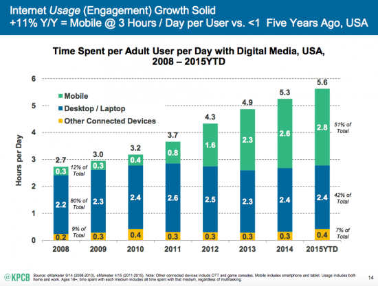

***Acknowledgements***
Many thanks to Elizabeth Boylan, Pete Brown, Fergus Pitt, Benjamen
Walker, Susan McGregor, and Emily Bell of the Tow Center for Digital
Journalism for their support. Special thanks to Claire Wardle for
generously giving me her time and fantastic feedback.
Also thanks to all those who took the time to speak with me (on or off
the record) for this project: Nick Quah (Panoply, Hot Pod), Robert S.
Boynton (NYU), Tom Webster (Edison Research), Noah Shanok (Stitcher),
Mark DiCristina (MailChimp), Jim Colgan (Audible), Brendan Monaghan
(Panoply), Christa Scharfenberg (*Reveal*), Rob Walch (Libsyn), Steve
Nelson (Infinite Guest), Jenna Weiss-Berman (BuzzFeed), Clea Conner
Chang (*Intelligence Squared*), Jake Shapiro (PRX), Angela Stengel
(First Run, ABC Radio), Kerri Hoffman (PRX), Hrishikesh Hirway (*Song
Exploder*), Erik Diehn (Midroll Media), Steve Wilson (Apple), Seth Lind
(*This American Life*), Parviz Parvizi (Clammr), Matt Lieber (Gimlet),
Sarah van Mosel (New York Public Radio), Caitlin Thompson (Acast), Andy
Bowers (Panoply), Jaclyn Friedman (Yes Means Yes), Mitra Kaboli (The
Heart), Benny Becker (Israel Story), and Aaron Mahnke (*Lore*). 
*December 2015*

Executive Summary
=================

This report aims to explain why podcasts matter to digital journalism:
as our world shifts to one of mobile consumption, podcasts represent a
form of mobile-first content that engages with audiences in ways that no
other mobile medium has previously.

This guide provides a detailed overview of the current podcasting
landscape, which is characterized by industry disruption, new networks,
increased podcast listening (especially on mobile devices), and
heightened consumer awareness. As part of this overview, I describe the
conceptual and technological challenges that podcasting must overcome if
it is to achieve meaningful growth and industry legitimacy. I also
briefly outline the challenges the industry faces as it looks to the
future: the issues of iTunes as a gatekeeper, the short-term and
long-term efficacy of networks, the ethical dilemmas that native ads and
branded content pose, and the need for more creativity and diversity in
content creation.

Podcasts are pursuing multiple revenue streams, including
advertising/sponsorship, foundation support, direct support,
subscription models, and live events. While advertising is currently the
fastest-growing and most lucrative stream, these last three streams
attempt to convert audience engagement and loyalty into recurring
donations.

Because there is no one-size-fits-all solution for generating revenue,
and each podcast/company follows a different business model, it’s
important to consider the operational philosophies that inform how
podcasts and networks raise revenue and prioritize revenue streams. This
guide explores the myriad ways these philosophies play out in four case
studies: PRX’s *Reveal*, Gimlet Media, BuzzFeed, and Panoply.

It is still too early to declare any podcast or podcast company a
“success.” Many podcasts/networks currently rely heavily on advertising
and are still experimenting with alternative revenue streams. Outside of
advertising and branded content, podcasts show the most potential as an
audience engagement tool that can diversify content, add value to
brands/consumers, and generate enthusiasm for direct support and/or
freemium models.

Introduction
============

Podcasting: A Brief History
---------------------------

In 1999, a few developers at Netscape had an idea for how to aggregate
content from a variety of sites so that a reader would never have to
visit any one individually to check for the latest updates. Instead, the
content would appear in one place automatically.[@WhatisRSS] They
launched a prototype technology and [called it RDF Site
Summary](https://en.wikipedia.org/wiki/RSS).[@RSSWiki] Today, we know
this technology as RSS (Real Simple Syndication).

In its original iteration, the RSS feed could only syndicate text.
However, in 2000, developers Dave Winer and Adam Curry adapted the feed
so it could include audio. In September 2003, Winer advanced the
software again, this time for a colleague at the Harvard Berkman Center,
journalist Christopher Lydon. At the time, Lydon was “audioblogging,” or
conducting in-depth audio interviews and inserting them into his blog
posts as mp3s. Thanks to Winer’s adjustment, readers could now subscribe
to Lydon’s blog and access the audio content automatically. During this
process, Lydon became the host of the first podcast, Radio Open Source,
which remains running to this day.[@PCHistoryWiki]

Exactly one year later, reporting for The Guardian, Ben Hammersley wrote
about various RSS technologies allowing audio to be downloaded, passed
to iTunes, and transferred to an iPod; he christened it “podcasting.”
The next month, *The New York Times* reported that people were
podcasting everywhere, from the United States to Australia to Sweden. In
November 2004, the first podcast hosting platform, Libsyn, launched. In
2005, Public Radio International hosted its first daily news podcast,
and one of the first podcast networks TWiT (This Week in Tech) made its
debut. Then, in June, [Steve Jobs announced on a stage in Silicon
Valley](https://www.youtube.com/watch?v=K0KNLCbzZUw) that podcasts, and
indeed an entire podcast directory, would be available in iTunes
4.9.[@JobsVideo] By December, the New Oxford American Dictionary
declared “podcast” the word of the year.[@PCHistoryWiki]

In 2006, podcasting continued to ride the coattails of this hype. The
Ricky Gervais Show became the most downloaded podcast in history, and
the world’s first live podcast tour took to the road.[@PCHistoryWiki]
*This American Life*, a weekly public radio program founded by Ira Glass
in 1996, jumped on the bandwagon, making the show freely available as a
podcast for the first time. Edison Research reported that at the time
[22 percent of Americans were aware of the term podcasting and 11
percent of the population had listened to a podcast at least
once](http://www.edisonresearch.com/the-podcast-consumer-2015/).[@EdPCconsumer]

Then the buzz subsided. Podcasting went under the radar, so to speak,
but it was growing slowly and steadily all the while. By 2014, Apple had
one billion podcast subscribers. Edison Research reported that now [48
percent of all Americans knew the term podcasting and 30 percent had
listened to a podcast
before](http://www.edisonresearch.com/the-podcast-consumer-2015/).[@EdPCconsumer]
Then in October, *This American Life* launched a spin-off show—one that
would be released in installments, or serially—each week. It was called
*Serial*.

The So-Called Serial Effect
---------------------------

Since *Serial* was released, the narrative on podcasting has centered
itself on a few cliché phrases: podcasting’s “back,” in a “renaissance,”
or a new “golden age.” There is no doubt, of course, that the show
marked a watershed moment in podcasting history. It took *This American
Life* four years to reach a million downloads per episode; it took
*Serial* [four
weeks](http://longform.org/posts/longform-podcast-159-ira-glass).[@IraLongform]
As of October 2015, the show has been [downloaded over 90 million
times](http://www.nytimes.com/2015/10/01/business/media/after-serial-what-podcasts-to-listen-to.html).[@NYTAfterSerial]

However, few articles have been able to rigorously justify the
“renaissance” moniker beyond *Serial*’s success. First of all,
podcasting metrics are notoriously murky, and thus it’s difficult to
pinpoint what podcasting [download numbers really mean in terms of
listener
numbers](https://medium.com/@pete/downloads-listens-listeners-and-about-those-podcast-numbers-73a5ee3e2fca)
(a single listener can download the same episode multiple times or
across devices, inflating download data; plus, a download does not mean
the downloader actually listened to the show).[@DLvsListen]

Secondly, many journalists covering this space overlook a vital factor
in *Serial*’s success: just a few weeks before the show’s launch, Apple
updated its mobile operating system, iOS, to include a native,
undeletable podcast app.

In all likelihood, this is why podcasting’s first boom never fulfilled
its initial promise of mainstream penetration: The technology (which
required one to go to the iTunes store, download an episode, and then
sync it to your device before you could listen on the go) was just too
prohibitive. Apple’s native podcast app, however, significantly lowered
the barrier to entry for a great many consumers (as evidenced by the
finding that Apple-device podcast downloads outpace Android downloads at
a rate of [5.4 to
1](http://www.libsyn.com/wp-content/uploads/2015/06/PRLibsynNetGrowth021915Final.pdf)).[@libsyndata]
Apple’s latest system update, iOS 9, released in September 2015, further
reduces the steps to access a podcast in the app. (In addition, it
favors streaming; it takes one click to stream, two to download.) *This
American Life*’s Seth Lind predicts that the technology will continue to
improve, eventually arriving at the point where podcasts, like music,
become something listeners can easily and instantly access, rather than
have to acquire.[@lind]

When *Serial* launched, it was the perfect storm: fantastically
reported, edge-of-your-seat content released just as for thousands of
iPhone users podcasts were suddenly easier to find, subscribe to, and
consume. Rob Walch, vice president of Libsyn, argued: “The iPhone has
done more for podcasting than anything else.”[@Walch]

Thirdly, despite the fervent media attention, *Serial* did not prompt a
significant spike in overall listener growth for podcasts more
generally. As Edison Research’ The Podcast Consumer 2015” report shows,
although people are now listening to more podcasts, overall audience
growth has remained slow and steady for the past decade. Today, a third
of the American population has listened to a podcast at least
once.[@EdPCconsumer] However, these numbers are still nothing in
comparison to terrestrial radio’s: [Over 91 percent of Americans listen
to the radio each
week](http://www.nielsen.com/us/en/insights/reports/2015/state-of-the-media-audio-today-how-america-listens.html),
and advertisers spend billions of dollars on radio each year ([radio is
a 16-billion-dollar
industry](http://www.statista.com/topics/1330/radio/)).[@nielsenradio; @statistaradio]
Podcasting is still far from meeting radio’s dominance in terms of
audience penetration or financial investment.

So what has changed since *Serial*? First, improved technology has made
podcasts easier to consume. Second, [consumers are becoming more aware
of podcasting as a
concept](http://www.edisonresearch.com/the-podcast-consumer-2015/).
Third, [those who already listen to podcasts are listening to more of
them](http://www.edisonresearch.com/the-podcast-consumer-2015/), about
six per week.[@EdPCconsumer] Fourth, the media has begun to follow
podcasting with more acute interest. And fifth, more and more
individuals and media outlets are starting to enter the space. [Libsyn
reports](http://www.libsyn.com/wp-content/uploads/2015/06/PRLibsynNetGrowth021915Final.pdf)
that more people signed up for new accounts in 2015 than ever before in
the company’s 11-year history.[@libsyndata] Since launching in February
2015, [Panoply has already acquired 20
partners](http://panoplymedia.tumblr.com/post/126958922613/eleven-shows-from-sports-illustrated-join-panoply)
interested in launching podcasts of their own.[@panoplyaudiometric]
Debuting on October 12, WNYC Studios, a new podcasting division of WNYC,
has similarly announced its partnerships with various authors,
celebrities, and media outlets such as The New Yorker and VICE
News.[@wnycstudios]

However, despite all the interest, few creators/outlets seem to know if
podcasts can be economically viable. While many articles have focused on
the potential of podcasting to grow audiences and earn revenue, there
has been no comprehensive overview of how podcasts/networks are earning
revenue today. The purpose of this guide is to do just that—to
illustrate the state of the podcasting landscape in 2015, and to address
the following central questions: Do podcasts generate revenue? How? What
are the existing business models? And are they sustainable over the long
term?

Methodology
===========

The purpose of this report is to address the changes happening in the
podcasting space, with a focus on the business side, and to answer the
three following questions:

1.  What are the business models currently in operation?

2.  To what extent have these business models proven successful?

3.  Do these business models seem viable/resilient in the long term?

There is no one directory that includes all published podcasts available
for study. The largest podcast directory is iTunes US; however, Apple
has not published a dataset with this information. In June, I analyzed
the Top 100 iTunes charts (cognizant that the top 100 does not mean the
most downloaded, as iTunes rankings are sorted according to a private
algorithm) and researched how each of these podcasts raises revenue. I
did not, however, create a sufficiently large dataset from which I could
draw overarching conclusions (for this type of analysis, I recommend you
read sociologist [Josh Morgan’s piece on
Medium](https://medium.com/@slowerdawn/how-podcasts-have-changed-in-ten-years-by-the-numbers-720a6e984e4e)[@morgan]).

I built on this first phase of research by undertaking a review of the
available literature, drawing particularly on industry reports such as
Edison Research’s “[The Infinite Dial
2015](http://www.edisonresearch.com/the-infinite-dial-2015/)” and “[The
Podcast Consumer
2015](http://www.edisonresearch.com/the-podcast-consumer-2015/),” and
Clammr’s “[Future of Podcasting
2015](http://www.slideshare.net/clammrapp/20150617-future-of-podcasting-2015-clammr-v-f).”
I also undertook a number of interviews with podcasting professionals,
attempting to interview a wide variety of stakeholders involved in the
business side of podcasting, including academics (NYU Professor Robert
Boynton), market researchers (Edison Research’s Tom Webster; Clammr’s
Parviz Parvizi), advertisers (MailChimp’s Mark DiCristina), tech
providers (Libsyn’s Rob Walch; Acast’s Caitlin Thompson; Stitcher’s Noah
Shanok), network executives, and content creators.

As well as understanding its business, I wanted to investigate
podcasting from the perspective of individual podcast creators and those
networks which produce multiple podcasts. I devised an initial list of
interviewees based on my spreadsheet of the Top 100 podcasts (choosing
those that had particularly successful, interesting, or unusual revenue
streams/trajectories). As I conducted these interviews, I employed a
snowball sampling technique, asking participants to recommend other
interview subjects, thereby expanding the list based on those
recommendations. This list included representatives from individual
shows (*Reveal*, *Intelligence Squared*, *Song Exploder*) and the
following networks/companies: Gimlet Media, Midroll Media, Panoply,
Infinite Guest, Audible, BuzzFeed, PRX, the Australian Broadcasting
Company, WBEZ, and New York Public Radio. Toward the end of my research,
I sought out information from podcasters who could fill certain gaps in
my research; for example, The Heart’s Mitra Kaboli and Israel Story’s
Benny Becker answered an email inquiry about running live events, and
Yes Means Yes’s Jaclyn Friedman and *Lore*’s Aaron Mahnke gave me
insight into running podcasts without network support.

Because this report gears toward a journalistic audience (both
individuals interested in launching/sustaining podcasts and media
outlets interested in pursuing podcasts), there are some significant,
important subsets of the podcasting community that are conspicuously
underrepresented—most notably comedy podcasts, talk radio podcasts, and
self-help podcasts.

I should also stress that this is a U.S.-centric report; because most
media in the United States is privately funded, the expectations of
consumer/foundational giving are substantially different than in
countries with strong governmental support of media. Also, due to the
fast-paced nature of this sphere, which changes on a daily basis, and
the time required to publish, I should warn the reader that this report
may be missing relevant information released after the final draft was
submitted.

Why Podcasting Matters
======================

Podcasting’s present and future, particularly its business models, are
relevant to digital journalism for two major reasons. First, podcasting
is a medium that lends itself to mobile consumption, and thus provides a
means for reaching audiences in ways other media cannot. Second,
podcasting offers a level of engagement with audiences that is
incomparable with other digital media; it thus presents a remarkable
opportunity for journalistic outlets to cultivate audience relationships
and experiment with new forms of revenue generation.

The Growth of Mobile
--------------------

[According to a report on mobile technology trends from
KPCB](http://www.smartinsights.com/internet-marketing-statistics/insights-from-kpcb-us-and-global-internet-trends-2015-report/),
Americans now use their smartphones more than any other device to access
the Internet—and it’s a trend that appears to be on the rise.[@KPCB]
Similarly, mobile listening is by far the predominant method of podcast
consumption today (63 percent of Libsyn-hosted podcasts were requested
from mobile devices in 2014, up from 43 percent in 2012, according to
[Libsyn’s internal
data](http://www.libsyn.com/wp-content/uploads/2015/06/PRLibsynNetGrowth021915Final.pdf)),
and it continues to grow month by month.[@libsyndata] Podcasting should
be considered a mobile-first medium.

As a mobile medium, podcasts have an advantage over text and video: They
can be consumed in the moments when visual media consumption is
inconvenient or impossible, like driving, commuting, exercising, doing
housework, etc. Angela Stengel, digital product manager at ABC Radio,
told me about an in-depth study in which ABC asked its listeners to
explain the role that podcasts play in their lives. The study *Reveal*ed
that, unlike radio, podcasts serve two kinds of functions: either to
keep listeners company in the home or office (in these cases, listeners
prefer host-led, chat-based podcasts) or to “transport them to another
world” (here, listeners prefer highly produced, story-based podcasts
like *Radiolab* or *This American Life*). In either case, however,
consumers are generally listening alone, from beginning to end, and
engaging intimately with the material.[@Stengel]

This is the kind of insight that podcast creators have long suspected
instinctively, but have not had the research to support their claims. As
Jenna Weiss-Berman, director of audio at BuzzFeed, told me: “I don’t
think it’s the kind of medium that lends itself to virality. It’s not a
one-minute video, and it’s not an article you can quickly scroll through
and look at the pictures and say you read it. You have to sit and
engage.”[@wb]

As such, podcasting offers an alternative vehicle for journalism: one
which is easily accessible on mobile phones (where more and more
consumers spend their time), privileged at certain hours of the day, and
has the unique characteristic of eliciting consumers’ close attention.

An Antidote to Advertising in the Internet Age?
-----------------------------------------------

At a time when consumers have become increasingly immune to display ads
(Doubleclick currently measures global click-through rates on display
ads at 0.06 percent), podcasts offer a potentially interesting vehicle
for digital advertising.[@ctr]

First, there’s the engagement that podcasts inspire in listeners. Mark
DiCristina explained that MailChimp likes podcast advertising because
“people are generally tuned into podcasts,” and thus the ads are
“sticky.”[@mailchimp] Sarah van Mosel commented: “All these
brands—regardless that we don’t have standard measurements and that you
can’t track things—come back again and again and again because of the
off-the-charts level of engagement podcasting has, that more than
compensates for the lack of metrics.”[@mosel]

Second, podcast listeners are loyal. They form relationships with hosts
and return to shows regularly. In Caitlin Thompson’s words:

> There’s a regularity in listens. If you’re The Huffington Post or
> BuzzFeed or Vox or Fusion, you can do a great job with reaching an
> audience with one particular piece of content, but it’s really hard to
> guarantee that they’re going to come back. That’s why you have monthly
> visitors versus unique visitors, and you want to have a healthy
> proportion of that, because you want to be attracting new people but
> you also want to be retaining others so your advertisers see that they
> know what they’re reaching.[@thompson]

Third, surveys suggest that podcasts, which typically have host-read
ads, don’t engender advertising aversion.[@wolfdenraphael] Two caveats
here: one, survey-takers complete surveys voluntarily, and so generally
represent the opinions of the keenest listeners; and, two, as [Vox’s
Philip Edwards](http://www.vox.com/2015/9/28/9408375/podcast-ads)
pointed out, podcasts have become oversaturated with the same ads, which
can be annoying—especially since they’re difficult to skip.[@voxphil]
Nevertheless, Mark DiCristina has found that:

> People typically don’t mind the ads because they’re read by the hosts
> and integrated into the content in a way that’s more natural than in
> other mediums ... there’s a transference of credibility that happens
> there.[@mailchimp]

Those podcasters unrestricted by the FCC guidelines that constrain
public radio have been further experimenting with means of integrating
ads into content in innovative and entertaining ways. Comedy podcasts
like [*The
Nerdist*](http://nerdist.com/podcasts/nerdist-podcast-channel/) and
*[WTF with Marc Maron](http://www.wtfpod.com)*, whose quick-witted hosts
work the ad copy into their conversations, are particularly successful
at this. Most prominent in this field, however, is Gimlet Media, which
sells its native ads as “the best mobile ad unit[s] in existence” (more
on this in the Gimlet case study below).[@lieber]

Obviously, these ads are digital. As technology improves and progresses,
podcast ads could one day offer the tracking capabilities and data that
online ads do currently. In the meantime, podcast ads certainly offer an
intriguing alternative to advertisers hoping to reach and engage with
digital, mobile consumers. As such, they could represent a paradigm
shift in the way we conceptualize advertising in the 21st century. Sarah
van Mosel explained:

Maybe scale is a very 20th-century way of looking at advertising. I
think the most amazing experiences are customized just for you.
Millennials aren’t jaded about marketing, they just have high
expectations for authenticity and customization—and they should.[@mosel]

Where We Are Today
==================

Creators are fond of describing podcasting as still in its “Wild West”
stage, a time when the rules haven’t been formulated (let alone
enforced) and everyone is—in terms of content, metrics, advertising
rates, and business models—flying blind.

This concept underplays the extent to which podcasting technology,
storytelling, and revenue creation has evolved since its emergence in
the early 2000s. Second, it elides the legacy of radio upon podcasting,
most particularly the strong influence of both talk radio and public
radio on its formats and revenue streams.

On the level of distribution and production, podcasting has
unquestionably disrupted radio, hurtling the major players into a state
of flux. Whereas local stations once relied on major distributors such
as NPR for content, and producers were equally dependent upon them for
reaching large audiences, the digitization of audio has rendered
traditional distributors unnecessary. PRX, the public radio exchange,
has pivoted from a station marketplace into an online platform where
producers can upload their work directly for stations to download.
What’s more, stations are no longer the only outlets for creators;
creators can share their podcasts on a variety of platforms, some of
which allow them to reach audiences and earn revenue directly.

“We’re in a position where every producer can also be a distributor if
they want,” Seth Lind, director of operations at *This American Life*,
explained. “There’s kind of an identity crisis, and this is happening at
the public radio station level, too. It’s like, ‘Are we producers? Are
we distributors? Do we need distributors?’”[@lind]

Distributors, even the public radio behemoths like NPR, have lost their
centrality in the audio ecosystem. *This American Life*, although still
distributed on public radio, has become an [independent, public benefit
corporation](http://current.org/2015/07/ira-glass-starts-own-company-for-this-american-life-serial/),
allowing it to maintain direct relationships with advertisers.[@talpbc]
Instigated by growing advertiser interest, and the need to bundle shows
to maximize impressions, new podcast networks like Gimlet Media and
Midroll Media have emerged, promising producers greater editorial
freedom, higher salaries, or both. Almost weekly, individuals are
leaving the public radio system to join them. Just this October, WNYC
announced the creation of WNYC Studios, a podcast division that will
self-distribute, raise money to develop programming, and hopefully
incentivize talent to remain within the company.[@wnycstudios]

Despite the uncertainty rife within the space, podcasting is making
significant strides toward mainstream legitimacy as an industry. Central
to this acceptance, of course, is achieving a critical mass of
listeners. All interviewees discussed this fact: Podcasts need bigger
audiences.

Public radio was able to grow its audience size by giving away
high-quality content for free and then monetizing that audience via
sponsorship and fundraising. Podcasts have inherited that mantra:
Content first, money later. In the words of Stitcher co-founder Noah
Shanok: “The single biggest inhibitor in terms of revenue is audience
size. As soon as the audience is there, dollars will follow.”[@shanok]
Seth Lind put it another way: “It’s sort of like an ‘if they come, we
will build it’ business model.”[@lind]

However, unlike public radio, podcasts are an on-demand medium. As
Panoply’s chief content officer, Andy Bowers, explained: Radio and
podcasting are “cousins, they’re not even siblings.” Podcasts are
“impossible to listen to by accident. Each time it’s a choice. Radio is
more laidback; you pick stations and program them in and you float
around. You don’t have to make a choice.” He added, “It’s harder to get
people to do that [to make that choice], but once you get them, they
tend to stay around, like they’ve joined a club.”[@bowers]

To reiterate Bowers’s point, “once you get them, they tend to stay
around.”[@bowers] However, the “getting them” remains the challenge at
hand, and podcasting still has significant barriers obstructing its
audience growth.

Podcasting’s Barriers to Growth
-------------------------------

Despite the work that *Serial* has done to make podcasting better known
among the public, the concept of podcasting remains foreign to many
listeners. Indeed, it could be argued that podcasting remains in an
“early adopter phase.” A [Midroll white paper shows that 67 percent of
podcast listeners are 18–34](http://awesome.midroll.com) (to compare,
only 30.2 percent of radio listeners fall in this
demographic).[@midrollpaper] The podcasting audience skews toward the
under-40s, a generation for whom the concept of on-demand content makes
sense.

Clea Conner Chang, the director of marketing for *Intelligence Squared*,
described the issue as a branding problem:

People say, “What’s a podcast? How do I get a podcast?” It has an
inherent branding problem. ... It’s just radio on demand. You can hear
your favorite show any time, and they just don’t realize how it works
yet, how convenient it is. It wasn’t until a couple of years ago that
streaming video became something with mass appeal, and this is streaming
audio. It still hasn’t made that association. ... Podcasting is on
this precipice of being something understood by the masses—it’s not
there yet.[@chang]

Closely related to the conceptual problem of podcasting (what is a
podcast?) is the technical problem (how do I get a podcast?). Mark
DiCristina, the marketing director for MailChimp (a company that
advertises on a variety of popular podcasts, including *Serial*),
explained the problem: “People still have to learn how to find podcasts.
The whole concept of podcasting is still hard for some people to get
their heads around. The technology will get better and there will be
easier ways to consume and find podcasts, but right now there’s still a
barrier.”[@mailchimp]

One attempt to overcome this problem and promote podcasting’s
cross-generational appeal is Ira Glass’s “How to Listen to a
Podcast”video, in which he and his elderly neighbor explain how
accessible podcasts really are.[@iramary]

Moreover, while podcast listening remains strong on iOS, and Apple’s
native podcast app continues to improve, Android users—whose numbers are
far greater than iPhone owners (one billion versus 470 million)—remain
an untapped audience for whom podcast listening remains
difficult.[@smartphones] Apple device podcast downloads outpace Android
downloads at a rate of [5.4 to
1](http://www.libsyn.com/wp-content/uploads/2015/06/PRLibsynNetGrowth021915Final.pdf).[@libsyndata]
Lind put it this way: “This is a moment in podcasting [Google and
Samsung are] not capitalizing on.”[@lind]

Although apps such as Stitcher have emerged to fill the gap for Android
users, they don’t compare to the ease of a native app. As Libsyn vice
president Rob Walch pointed out, podcasting has been “an Apple-centric
media because Apple has been behind it to promote it. Android will never
come close to iOS until Google installs a native player in Android.”
Indeed, to reach listeners on Android devices, Walch recommends that
shows develop their own apps so that users can more easily search for
and access their content.[@Walch]

With or without an app, searching for podcasts remains somewhat
difficult on iOS and Android alike. The same is true for discovering new
podcasts. According to [Clammr’s 2015 survey of
podcasters](http://www.slideshare.net/clammrapp/20150617-future-of-podcasting-2015-clammr-v-f),
cross-promotion on other podcasts, social media, and word of mouth
remain the main ways listeners learn of new shows.[@clammrfuture] Walch,
who has over a decade of experience in the podcasting space, maintains
that word of mouth will remain the most popular way podcasts are
discovered and shared.[@Walch] Others, such as Acast’s Caitlin Thompson
and Panoply’s Andy Bowers, point to Netflix, which has successfully used
algorithms to aid viewer discovery, as a potential reference point for
podcasting’s future.[@thompson, @bowers]

Companies such as [Clammr](http://www.clammr.com/) have emerged to try
to make audio—a “fundamentally not social” technology in the words of
Clammr CEO Parviz Parvizi—“easier to clip and share on social
media.”[@parvizi] Hosting platform [Acast](http://www.acast.com/)
includes a socially rich player as an incentive for podcasters to use
its services. [Pop-Up Archive](https://www.popuparchive.com) is
transcribing podcasts in an effort to make them both easier to discover
and share. A recent [audio hackathon](http://audiohackathon.com/),
sponsored by *This American Life*, similarly focused on ways that audio
technology could enable more social listening
experiences.[@hotpodhackathon]

Despite these early efforts, podcasting creators remain uncertain of the
extent to which improved sharing and discovery tools are vital to
podcasting’s growth; far more important, as *New York Magazine*’s Kevin
Roose has pointed out, is the development of dashboard technology that
will make podcasts easier to listen to in the car.[@PCcars]

Because [almost half of radio listening happens in
cars](http://qz.com/195349/the-remarkable-resilience-of-old-fashioned-radio-in-the-us/),
integrated dashboard technology—such as Apple’s CarPlay and Google’s
Android Auto—could offer the key to unlocking audience
growth.[@radiocars] As Gimlet Media’s Matt Lieber said, “Until we have a
mainstreamed solution to digital audio in cars, we’re being held
back.”[@lieber] Most major automakers have already begun to integrate
the technology into their latest models. [GM, for example, is
aggressively adding Apple CarPlay to Chevrolets and
Cadillacs](http://gizmodo.com/chevy-is-bringing-apple-carplay-and-android-auto-to-the-1707219276).[@gm]
A report from IT advisory firm [Gartner predicts
that](http://www.forbes.com/sites/samsungbusiness/2015/09/23/how-your-car-is-becoming-the-next-hot-tech-gadget/)
“by the end of 2020, 70 percent to 80 percent of all new vehicles in the
United States will offer connected-car functionality.”[@gartner] Of
course, since consumers buy cars [every 11 years or
so](http://www.forbes.com/sites/jimhenry/2012/01/20/average-car-in-the-u-s-now-over-10-years-old-a-record/),
it will take about that time for radio consumers to convert into podcast
listeners in significant numbers.[@carbuying]

Metrics, Consumer Data, and Industry Standards
----------------------------------------------

Even though many platforms, such as SoundCloud and Acast (which both
stream audio), have sophisticated analytics, the fact remains that the
majority of podcasts are downloaded through iTunes (roughly 70
percent).[@digiday] Once a podcast is downloaded, there is no way of
knowing what happens to the file, how long it was listened to, how many
times, or when. Moreover, since the subscribers “belong” to iTunes,
creators have little knowledge of their listener demographics.

There are two camps in the podcasting sphere: One maintains that the
tools of radio (surveys, extrapolations, etc.) are sufficient for
podcasting measurement. The other wishes to push podcasting technology
far enough to exploit the medium’s full digital potential—to the point
that everything is “point to point measured,” in the words of Sarah van
Mosel.[@mosel]

Unlike online journalists, who have a plethora of statistics at their
fingertips that allow them to make informed decisions about how to
format and publish their content, podcasters have almost no idea how
their audiences interact with their work. PRX CEO Jake Shapiro believes
this kind of information would create “a feedback loop for producers, so
they know who their audience is, how they should craft their stories,
what time of the day or the week they can release them.”[@shapiro]
Panoply’s Nick Quah agreed: “What did Chartbeat do for digital media? It
ruined a lot of journalists’ lives, because it’s all they ever think
about. We want to get to that level.”[@quah; @petre]

Of course, improving metrics and data on consumers would also prove
invaluable to another group: advertisers. As podcasting advertising
begins to expand to include not just direct response advertising but
also brand advertising, this information becomes all the more vital. Van
Mosel explained: “Branding people have a picture of the person they want
to reach in their mind. You can get at it with surveys, but the Holy
Grail, the next big step, is to figure out how to link back to the
demographic and psychographic data that you can prove and then target
to.”[@mosel]

Mark DiCristina, marketing director for MailChimp, put it this way: “I
would love to know all kinds of data: demographic data, age, gender,
income, industry type, what they do for work, what percentage are in
marketing or use email marketing. For now I’ve accepted that’s not
available any time soon.”[@mailchimp]

Although advertisers like DiCristina have come to terms with limited
consumer data for downloaded podcasts, there is, at least, some progress
around better understanding listeners who stream podcasts. At WNYC, van
Mosel has already overseen the conversion of ads into dynamic,
programmatic ads, which can be continually trafficked into shows’ back
catalogues (where about 40 percent of listening occurs, vastly
increasing ad impressions).[@mosel] These ads also include tracking
pixels that advertisers can use to ensure ads are delivering; as van
Mosel explained, it’s a “lifeline to say ‘legitimacy is happening
here.’”[@mosel] Acast similarly injects trackable ads at point of play,
and Panoply recently acquired the tech company Audiometric in order to
offer a similar technology (for more on this, see the Panoply case
study).

Another signal of podcasting’s imminent exit from the Wild West is the
emergence in the last six months of two separate podcasting upfronts
(intended to inspire advertisers to sponsor upcoming content). Also
notable is the creation of a working group at the Interactive
Advertising Bureau, which aims to establish advertising standards. Many
of the podcasters I spoke with recognized the need for an objective
standard for audience measurement, one which all podcasters could agree
to follow. Matt Lieber, president of Gimlet Media, suggested a reliable
third party that will audit podcasting data, much as the Nielsen Ratings
do for television, as a vital next step in legitimizing the podcasting
industry.[@lieber]

Revenue Streams
===============

As any media outlet in the 21st century is more than aware, diverse
sources of revenue are necessary for long-term sustainability. Outlined
below are four major sources from which podcasts and podcast networks
generate revenue: advertising and sponsorship, direct support,
foundation support, and membership/subscription models. Also mentioned
are a few streams that, while generally less lucrative, are easy to
implement or serve strategic purposes, such as live events and
partnerships.

The division between these categories is somewhat arbitrary (what, in
essence, distinguishes a wealthy individual’s large donation from a
foundation’s small contribution?); however, I have borrowed these
categories from interviewees who explicitly mentioned the following
revenue streams in these terms. More important to note is that each
podcast/network finds its own balance between these sources—some depend
significantly on advertising while others maintain public radio’s
“three-legged stool” philosophy (in which three revenue sources—usually
advertising, direct support, and foundation support—are conscientiously
and purposefully given equal weight).

Advertising and Sponsorship
---------------------------

For those I interviewed, advertising is currently podcasting’s most
lucrative and fastest-growing revenue stream. Advertisers have
traditionally utilized podcasts for direct response ads (in which the
host gives listeners a code or URL to receive a discounted service;
these ads’ success have allowed podcasts to charge high rates).[@bowers]
However, brand advertisers are becoming more prevalent. Although
CPMs[^1] vary depending on audience quality and the level of host
attention the ad receives, podcast advertising is, according to
DiCristina, remarkably cost-effective compared to advertising in other
media.[@mailchimp]

Direct Support
--------------

From the beginning, podcasts have leveraged their direct audience
relationships by asking for listener support via donations or pledges.
Taking a cue from public radio, the Maximum Fun network does [yearly
pledge drives and has a tiered membership model, for
example](http://www.maximumfun.org/donate).

Jake Shapiro foresees direct support happening in innovative ways in the
future, as PRX (and podcasts in general) seeks to convert “passionate
fan support into a more sustained way of long-term
contributing.”[@shapiro] [Patreon](https://www.patreon.com/), a site
that allows consumers to regularly support creators, has become a
popular option for many podcasters. Although not meant for listener
donations per se, the *StartUp* [Hearken](http://www.wearehearken.com)
provides media outlets with [listener support modules that allow
listeners to engage with the creation process from inception to
publication](http://knightfoundation.org/blogs/knightblog/2015/7/27/curious-city-inspires-scalable-model-engagement-journalism-answers-peoples-questions/)
(which could potentially make listeners more amenable to contributing
financially). Kickstarter has been used to fund specific goals around
launching new podcasts or funding new seasons, as well. [Radio
Ambulante](http://radioambulante.org) was one of the first to have
success with Kickstarter; in early 2012, about a year into the project,
it [raised 46,032
dollars](https://www.kickstarter.com/projects/1255653356/radio-ambulante/description)
(just over its 40,000-dollar goal).[@ambulante]

PRX has also seen marked success with Kickstarter campaigns. In August
of 2012, Roman Mars hoped to earn 42,000 dollars for the third season of
his popular show 99% Invisible, distributed by PRX. He used both
challenge grants and stretch goals to incentivize donors. In the end, he
[raised over 170,000
dollars](http://current.org/2012/08/podcast-with-limited-radio-airplay-sets-kickstarter-record/).[@mars]
In November of 2014, PRX and Mars turned again to Kickstarter to fund
their podcast collective/network Radiotopia, hoping to raise 250,000
dollars. They [raised 620,412
dollars](http://knightfoundation.org/blogs/knightblog/2014/11/14/radiotopia-sets-record-for-publishing-and-radio-funding-on-kickstarter/)
and became the most-funded radio/podcast project in Kickstarter
history.[@radiotopia]

However, while Kickstarter is a tremendous opportunity to raise both
funds and media attention, it’s by no means a sure bet. A brief glance
at the Kickstarter audio and radio/podcast pages shows dozens of
Kickstarter ventures that failed to attain their goals. A successful
Kickstarter campaign requires strategic and time-intensive marketing
initiatives.

Foundation Support
------------------

Not-for-profit podcasts in particular have found success in cultivating
grants from foundations that align with the podcast’s content or
mission. For example, Radiotopia was awarded a [one-million-dollar grant
from the Knight
Foundation](http://www.niemanlab.org/2015/05/knight-foundation-invests-1-million-in-creator-driven-podcast-collective-radiotopia/)
in May to develop new shows and reach new audiences.[@million] Of
course, grant money often comes with strings attached; foundations
generally give money on the condition that content producers cover
certain topics/issues.

Membership, Subscription, or Premium Models
-------------------------------------------

Many podcasts and podcast networks—including Gimlet Media and Midroll
Media—have recently rolled out subscription or premium models, in which
paying subscribers receive extra perks (such as limited ads, bonus
episodes, archival episodes, early access to live events or content,
members-only content, etc.). Almost all of these shows and networks
continue to offer their regular shows for free (with ads included of
course). The only audio company that is entirely subscription-based is
Audible, which will [soon offer access to original audio
content](http://www.geekwire.com/2015/amazon-makes-moves-into-original-podcasting-hires-npr-vp-of-programming/)
to its paying subscribers (and to paying subscribers only).[@nuzum]

Live Events and Other Streams
-----------------------------

Many podcasts are now experimenting with live events as a way to
generate revenue. However, even though shows often sell out, the costs
of event production can nullify revenue. Mitra Kaboli, a producer for
The Heart, has been helping to produce live events for the podcast for
the last three years:

> We always sell out. ... Do we make money? Not enough to consider it
> a revenue stream. The goal is to break even. It’s more about audience
> engagement and ramping up excitement about X. Maybe it’s a new season;
> maybe it’s an episode that we think is exceptionally good.[@heart]

Slate similarly hosts live events to reinforce audience engagement,
especially for Slate Plus members, who get early access to tickets and
opportunities to meet the hosts.[@bowers]

For shows that are more than conversation-based, and thus take more time
to create and produce, tours offer greater opportunities for revenue
generation than singular events, as the same show can serve for multiple
ticket sales (although obviously, they require greater time commitments
and logistical planning). Spaces are often donated, and sponsors can
help offset costs, either in the form of money or
food/drinks/decorations, etc.[@heart; @israel] Of course, for shows
within networks, sponsorship must be coordinated through the network,
which can sometimes limit shows’ options. All in all, live events are a
great way to engage audiences but a difficult way to consistently
generate revenue unless you are willing to seek out sponsorship and
perform multiple iterations.

A word of caution. For many podcasts, live events preceded the podcasts
themselves (in the case of the live storytelling organization [The
Moth](http://themoth.org), it was the podcast, which resulted in
listener donations and advertising revenue, that made the organization
[financially viable for the first
time](http://www.earwolf.com/episode/lea-thau-creator-and-host-of-strangers/).)[@lea]

Less common, although potentially interesting sources of revenue are
classes and workshops in which podcasters leverage their positions as
experts in certain subject matters or their knowledge as audio content
creators. For example, Gimlet’s Alex Blumberg offers a class on [audio
storytelling for purchase on
creativelive.com](https://www.creativelive.com/courses/power-your-podcast-storytelling-alex-blumberg).

Another, albeit indirect, method of earning revenue is partnering with
outlets that can distribute to their audiences (increasing impressions
and advertising revenue) and/or support reporting/production costs.
Radio Ambulante has proven adept at this strategy, partnering with
organizations across the United States and Latin America to reach
audiences across the globe.[@ambulantecs]

And, although none of my interviewees cited these as major revenue
makers, many podcasts also sell merchandise on their websites and earn
money from [Amazon’s Associates
program](https://affiliate-program.amazon.com/gp/associates/join/compensation.html)
(which gives podcasts kickbacks for referring listeners to amazon).

Case Studies
============

Rebranding and Regaining Control: *Reveal*
------------------------------------------

Go to the website of the [Center of Investigative Reporting
(CIR)](http://cironline.org) and a window quickly pops up, redirecting
the visitor to the center’s “new
home”—[revealnews.org](https://www.revealnews.org/)—where you can find
CIR’s reports, radio show, and podcast. What was once the Center of
Investigative Reporting has today been rebranded as *Reveal*, a new
identity with a podcast at its heart and center.

Christa Scharfenberg, *Reveal*’s managing director, explained the
unusual shift. The Center of Investigative Reporting began life in 1977
as a not-for-profit that produced in-depth, investigative reporting and
depended on a network of news outlets for distribution. Newspapers and
television stations would pay the center an annual “subscription” fee in
exchange for access to CIR’s reports. Over time CIR found that
newspapers had less and less of a budget to pay for investigative
journalism—for subscriptions and one-off stories, too. What’s more,
there was a more systemic problem with the business model: CIR didn’t
own a relationship with its audience.[@reveal]

CIR began to brainstorm options for content it could create and
distribute itself that would allow for complete editorial control and
direct engagement with its audience. Video was an option but an
expensive one. Audio, on the other hand, seemed more viable.[@reveal]

The center put together a pilot for PRX, which had recently received
funding to develop new shows. In the process, Scharfenberg told me, they
realized the podcast “could transform CIR away from its reliance on
other media organizations. We were controlling our own destiny, owning
our own show on various platforms. We rebranded ourselves as *Reveal*
[…] and transformed our organization.”[@reveal]

Despite its newfound focus on the podcast, *Reveal* ensures content is
accessible to its audience in various formats and across all platforms.
For example, one big investigation could lend itself to a television
spot, a radio show, podcast, online article, and a multi-media piece.
The podcast, however, remains central: “On the podcast, there’s more
room to talk about elements of the investigation, since the times aren’t
as tight. Plus, we get that direct audience relationship. [The podcast]
might become the most important thing we do,” said
Scharfenberg.[@reveal]

Of course, the podcast never would have happened without the initial
investment from (and subsequent relationship with) PRX. Scharfenberg
told me that the network has been “totally invaluable,” saying, “We
benefit from all of the learning that they’ve done already. They do the
underwriting, they’re able to package *Reveal* with other podcasts that
they represent. They’re willing to get companies to take a risk on
this.”[@reveal]

*Reveal* is not just risky for advertisers in terms of its nascent
numbers, but also because, Scharfenberg said, not many companies are
interested in sponsoring hard-hitting investigative journalism. On the
flip side, *Reveal* must be very careful in both its selection of
sponsors and its creation of ad copy if it is to maintain its
credibility and journalistic integrity. The team has decided to avoid
host-reads in order to maintain a strict line between editorial and
advertising.[@reveal]

Beyond advertising, PRX helps the young show to “get seen and
differentiate” itself in its quest for audience growth.[@reveal] This
September, the show was cross-promoted on popular PRX (and Radiotopia)
shows Criminal and 99% Invisible. That same month, it was featured in
iTunes, bumping it to the “Top 5 News and Politics” charts. *Reveal*
“went from just under 75,000 iTunes downloads in August to over 220,000
in September.”[@christa]

Scharfenberg has also developed a relationship with the editorial staff
at Stitcher (the most popular podcast app on Android). A feature in the
company’s newsletter elevated *Reveal* from 10,000 Stitcher listeners a
week to 70,000. The show also runs campaigns to encourage listeners to
rate and review the show on iTunes, which is the only way that
podcasters know they can impact their iTunes ranking.[@reveal] “Looking
at all podcasting platforms combined (iTunes, Stitcher, and dozens of
smaller ones),” Scharfenberg told me in an email, “we’re seeing really
great growth: approximately 125,000 downloads and streams in June,
350,000 in July and in August, and 470,000 in September.”[@christa]

In an effort to potentially reach new audiences and benefit from
carriage fees[^2], *Reveal* also plans to air the show on the radio in
January.[@reveal]

*Reveal* only began to hit sufficient download numbers to attract
underwriters and generate revenue from sponsorship this fall. However,
Scharfenberg remains hopeful that the numbers will continue to grow and
the podcast will ultimately make CIR’s business model more sustainable.
Not surprisingly for an investigative reporting team (whose work is
extremely time-intensive and often not profitable), the work has been
reliant on individual and foundation support (to the point where about
90 percent of CIR’s funding is philanthropic). One of the biggest
motivations behind launching *Reveal* was for CIR to diversify its
revenue streams.[@reveal] Scharfenberg explained:

> Having the show and having a consistent presence with audiences is a
> real opportunity to develop new sources of revenue. […] As a
> nonprofit, we can make a membership model, something we couldn’t get
> off the ground when we worked with other news organizations. Now that
> we have control of our audience, we can.[@reveal]

### Takeaways

-   Podcasts can allow you to own a relationship with your audience and
    engage with listeners directly.

-   Podcasts can provide another platform for reaching consumers, one
    which can be used in conjunction with other media formats.

-   Podcasts can offer a way to diversify revenue streams, including
    direct support from audiences.

-   Radio broadcasting and podcasting are not mutually exclusive; both
    can be used to earn revenue and reach audiences.

-   Audience growth remains a significant challenge, one which networks
    can help shows to overcome.

-   Journalists must exercise caution when choosing sponsors in order to
    maintain credibility.

Innovation in Advertising: Gimlet
---------------------------------

Over the last few months, I sat down with some of the biggest players in
the industry and asked who, in their opinions, is doing the most
innovative work in podcasting. Almost everyone I interviewed invariably
referred to one company: Gimlet Media.

Considering the considerable media attention Gimlet has garnered (and
the fact that its origin story is eloquently articulated in [season one
of its show
*StartUp*](https://gimletmedia.com/show/startup/episodes/season/season-1/page/2/)),
I will use this case study to briefly explore why Gimlet is so admired
and the ways in which it has (and hasn’t) disrupted the public radio
mentality.

First and foremost, Gimlet has experimented with native advertising in a
way that no other media outlet has. Although the company initially
partnered with Midroll Media to plug into the network’s ad sales
infrastructure, the company quickly accumulated the numbers necessary to
work with advertisers directly. Moreover, Gimlet knew it was creating
something of higher value than your typical host-read. As Matt Lieber
explained: “[The ads are] high-touch. We produce them, and they’re
customized, and that requires a direct relationship with the
advertiser.”[@lieber]

Although each promotional spot is demarcated with special ad music to
differentiate it from the rest of the episode, Gimlet ads are crafted by
the hosts themselves, who use them as opportunities to craft
mini-stories about the sponsor. The approach has allowed Gimlet to
distinguish itself from other podcasts and charge higher CPMs (about 60
to 100 dollars for midroll ads, compared to more typical rates of 20 to
45 dollars).[@matt; @cjr]

The ad strategy, then, has been to focus on quality and produce smart
brand advertising for big-budget companies, rather than to chase scale.
This is in direct response to the digital advertising landscape where we
currently find ourselves. In Lieber’s words:

> The economics of the web today are brutalizing because it’s a numbers
> game. You have to make an enormous amount of content to make up for
> the fact that the numbers are quite low […] that’s not a world I want
> us to enter.
>
> I think there are a couple of things that are different about
> podcasting. One is, in today’s world, the amount of premium content
> that’s extremely high quality is kind of scarce. That helps us. I also
> think the ad unit in podcasting is fundamentally a better ad unit than
> display ads. It’s baked into the show, it’s read by the host, and when
> you do a good job, listeners want to hear them. I could open up the
> Twitter feed and read the people who say, “I love your ads.” They’re
> entertaining and interesting.
>
> Media companies are looking to mobile and saying, yes it’s a good
> opportunity, but we don’t know how to make money there. We’re making
> money there. I may be biased, but I think we have the best mobile ad
> unit in existence.[@lieber]

Although Gimlet has found success with its advertising model (it should
raise about two million dollars in revenue from its first year), the
company seeks to introduce alternate revenue streams as a way of
safeguarding against potential downturns in the market. Its most
important alternative revenue stream so far is a new [membership
model](https://gimletmedia.com/join-gimlet/) (offering merchandise,
early access to events, and bonus content) that will hopefully convert
listeners into customers. In the future, Lieber foresees a third stream
that could center around live events or commerce.[@lieber]

Another way Gimlet has set itself apart from many podcasts is by
courting venture capital, both from individual investors and a campaign
on the crowdfunding site Alphaworks. (To understand this fully, listen
to [*StartUp* Season
1](https://gimletmedia.com/show/startup/episodes/season/season-1/page/2/)).[@startup]

Also notable is Gimlet Media’s efforts to support talent and attract
high-quality producers. Unlike Radiotopia, in which producers maintain
ownership of their shows, a Gimlet show typically belongs to Gimlet.
However, in exchange for ownership, Gimlet attempts to “super serve the
creator” with top-notch editorial support, financing, marketing
(including cross-promotion across shows), a built-in audience, and
competitive salaries. Moreover, at least in the podcasting world, the
Gimlet “g” has come to stand for quality.[@lieber]

“The people at Gimlet are really proud to be part of Gimlet,” BuzzFeed’s
Jenna Weiss-Berman told me. “It’s a culture, and when a Gimlet show
comes out you know it’s going to be good. You know it’s going to have a
level of production that very few other networks have.”[@wb]

Part of the limitations of the Gimlet model, of course, is that
production is slow. In order to maintain its standard of quality, the
network has only launched three shows so far. Unlike Panoply, which
partners with various media publishers to help produce podcasts (often
conversational shows that align with existing content, and thus require
less preparation and editing), Gimlet producers craft each show
in-house, reporting and editing both the content and the ads. Moreover,
the shows have not significantly departed from public radio in terms of
content (whether this is even desirable, of course, is up for debate).

### Takeaways

> Podcasting offers ways of experimenting with advertising and an
> opportunity to stand out from the online-mobile advertising sphere.
>
> CPMs remain malleable, especially when the advertising content is
> bespoke (in this case, advertising can become an important revenue
> stream).
>
> When a podcast’s numbers reach critical mass, the show can develop
> direct relationships with advertisers.
>
> If networks are to maintain talent, they must super-serve their
> creators.
>
> Gimlet is betting that scale will follow quality.

Deeper Than Listicles: BuzzFeed
-------------------------------

When BuzzFeed launched its first podcasts in March 2015, there was
widespread speculation that the company, known for its metrics-driven
approach, would figure out how to make audio “go viral.”

The reality, BuzzFeed’s director of audio, Jenna Weiss-Berman,
explained, is that virality is the last thing on her mind. Since
arriving at BuzzFeed in November 2014, Weiss-Berman has been focused on
one thing only: creating quality content so “that the BuzzFeed name is
on good stuff.”[@wb]

Weiss-Berman likens BuzzFeed’s podcasting venture to the company’s
decision to spearhead an award-winning investigative journalism team. In
Weiss-Berman’s words:

> They change lives through their work, by doing these amazing
> investigations, but their numbers are never going to be as high as a
> 100 cutest cats list. That’s just the way the world works. ... What
> we’re doing is more in line with [them]. We’re not trying to get 10
> million listens. We have things on the site that easily get 10 million
> hits. We’re trying to do something that shows that BuzzFeed has many
> different sides. We’re trying to dive deeper into some of the stuff
> that we do. That’s what BuzzFeed is great at. The things that make a
> bunch of money can support the things that make less money.[@wb]

Without the immediate pressure of generating traffic, Weiss-Berman has
been given license to experiment with content. So far, she has tapped
into internal talent by creating a pilot season in which interested
BuzzFeed staffers pitch a show. From the first round, two podcasts
emerged: Internet Explorer and Another Round. However, Weiss-Berman
assured me her team is “not precious about anything”—should the numbers
drop, they’ll “cancel it and try something new.”[@wb]

With Another Round having proven popular with readers, BuzzFeed has
already been able to generate advertising revenue without even really
trying: “When I first started,” Weiss-Berman confessed, “they said just
worry about the content, don’t worry about the money making stuff. We’ll
revisit that a year in. ... We got so much interest quickly that I
[thought], it’s crazy for us to say no to free money. Within three
months, we were doing a trial thing.”[@wb]

The “trial thing” has been a foray into native advertising—however, not
by Weiss-Berman and her editorial team. With her journalistic ethics
formed in public radio, Weiss-Berman said she has tried to establish a
hard line between editorial and advertorial. (Although hosts can read
spots, for example, they do not do endorsements.) Members of BuzzFeed’s
creative ad team—who had never used a recorder before—produced the first
series of ads, promoting a razor designed for African American men.
Weiss-Berman admitted that they’re still progressing and experimenting
with the ads, which draw heavily from Gimlet’s example. On the positive
side, since the ad team is unencumbered by the history of radio and
podcast CPMs, it’s open to experimenting not just with different
(higher) rates, but also new ways of charging for content (charging lump
sums for a short-run series, for example).[@wb]

Looking to the future, the BuzzFeed editorial team plans to work with
external talent, most likely on short-run, series projects. Weiss-Berman
is even open to one day hiring a creator to produce a show under the
BuzzFeed umbrella—a move that would put BuzzFeed firmly into network
territory. However, for now, Weiss-Berman remains committed to
developing shows from within the BuzzFeed family, to provide consumers a
different kind of content.[@wb]

### Takeaways

-   Podcasts can be used to diversify content and add value to online
    audiences.

-   Outlets can tap internal talent as a way of creating new content.

-   A strong brand identity and audience can ensure advertiser interest.

-   It’s possible to establish a line between editorial and advertorial,
    though ad quality may be sacrificed.

-   Podcasting rates are still in early days; CPMs need not be the only
    method of advertising revenue.

The Podcast Purveyor: Panoply
-----------------------------

In August 2015, the podcast network Panoply announced that it had
acquired a software product named Audiometric, “a producer-focused
podcasting CMS and ad insertion technology.”[@panoplyaudiometric] To the
layman, this might sound like an innocuous move. To the podcasting
insider, the acquisition offered a major insight into how Panoply,
already one of the biggest players in the field, is strategizing its
future growth.

Panoply was born from The Slate Group, which has been in the podcasting
business for a decade and can now boast a steady stable of popular,
mainly conversation-based shows. Capitalizing on the fact that Slate’s
audience, and particularly its podcast listeners, is highly engaged and
loyal, the company launched a membership platform in April of last year
called Slate Plus.[@bowers]

All this time, Slate functioned as a podcast network does—people
recognized the Slate name and were willing to try other Slate podcasts
as a result. However, Panoply, the official “audio arm” of The Slate
Group that launched in February 2015, was meant to be something
new.[@slatepanoply]

Panoply does include Slate shows, however, the network was
conceptualized as an independent operation that partners with a variety
of publishers seeking to develop their own podcasts. Panoply now boasts
15 Slate podcasts and over 20 partners, from *The New York Times*
Magazine, to Real Simple, to The Huffington Post.[@panoplyaudiometric]
Panoply provides these partners with advertising, technological,
production, and audience development services in exchange for a share of
the advertising revenue. The exact split is determined according to the
partners’ reliance on Panoply (for example, if a partner already has
recording capabilities, this would affect the split).[@monaghan]

Advertising revenue is generated via host-read ad spots charged at, in
the words of Panoply CEO Brendan Monaghan, “meaningful CPMs” (this
translates to between [20 and 80
dollars](http://www.niemanlab.org/2015/08/how-podcasters-are-turning-to-new-technologies-and-partnerships-to-introduce-programmatic-ads/)).[@monaghan; @programads]
Panoply is also exploring the options of branded content and native
advertising. In early October, it announced its latest venture: a
partnership with GE on an eight-part science fiction drama that hearkens
back to the [GE
Theater](https://en.wikipedia.org/wiki/General_Electric_Theater) of the
1950s. The episodes, free to download for consumers, are [also
ad-free](http://www.reuters.com/article/2015/10/02/ge-podcasts-idUSL1N11Y1D120151002the)
(and thus serve to raise brand awareness for GE rather than directly
generate sales).[@reuters]

Panoply is similar to networks like Gimlet Media and Radiotopia in that
it hopes to create a brand identity that stands for quality—and thus
attracts listeners and advertisers. As Brendan Monaghan, Panoply CEO,
told me, the network creates “an opportunity to help audiences find and
discover great content.”[@monaghan]

However, in many respects, Panoply represents a very different network
model. As Panoply CCO Andy Bowers explained, the network has always had
two constituencies: consumers as well as producers. Panoply’s efforts to
reach consumers are done in collaboration with their partners: “We very
much want a show’s first audience to be the audience of the magazine or
author. That is the audience they know best, who’s most likely to tune
into a podcast by the organization or individual,” said Bowers. Should
Panoply one day wish to replicate the success Slate has had with its
freemium model, for example, it would undoubtedly do so in collaboration
with its partners. Bowers added, “We’re not expecting to have Panoply
‘groupies.’ We want Panoply to be a wider network. Panoply will come to
mean quality podcasts from reputable people and organizations.”[@bowers]

The acquisition of Audiometric emphasized that, for Panoply, the podcast
creator is arguably just as important—if not more than—the listener.
Monaghan said in [the press
release](http://panoplymedia.tumblr.com/post/126434082888/panoply-acquires-next-generation-ad-management-and):
“We originally launched Panoply to provide listeners with a network of
the best voices in podcasting, but along the way identified that there
was an opportunity to provide partners with meaningful technological
solutions as well.”[@panoplyaudiometric]

Audiometric will allow Panoply to offer a better technology to its
partners than currently exists. The process of uploading, distributing,
and tracking a podcast requires fluency on a variety of platforms; plus,
the process of inserting ads dynamically into downloadable podcasts is
both hard and expensive. Audiometric is a “producer-friendly,”
end-to-end platform that provides hosting, management, monetization,
dynamic ad injection and targeting, excellent analytics, and
distribution (even to external podcasting apps)—all in one place.
Panoply may also develop an embeddable player in the future (only
SoundCloud and Acast currently offer players); however, for now, the
technology is meant to work with all existing platforms.[@monaghan]

The technology’s capacity for more accurate analytics is one of its core
advantages. Panoply’s Nick Quah hopes that the detailed analytics will
not just allow creators to better cater their shows to their audiences,
but also push podcasting more fully into the world of digital
journalism.[@quah] What’s more, of course, the more accurate the
metrics, the more advertisers will invest in the space (unsurprisingly,
Panoply is also on the [IAB working
group](http://www.iab.net/member_center/committees_councils/working_groups/Podcast_Business_Working_Group)
focused on establishing industry standards for podcast ads).

Although the technology has been designed for the use of those within
the Panoply network, Bowers told me he could “envision a future” where
people outside the network can access the technology—presumably for a
fee.[@bowers] For Panoply, which has ads at the core of its business,
this technology play represents the company’s move toward a more
independent business model. Not only does it decrease the network’s
reliance on outside technological platforms, but it also creates a
potential alternate revenue stream to advertising as it amplifies the
possibility for increased advertising revenue through its dynamic ad
injection.

It also signifies (to my mind) the network’s embrace of the
producer-facing side of its identity. Indeed, if Audible could be
compared to HBO (a subscription-led network), and Gimlet perhaps to AMC
(a more mixed model), I would liken Panoply to Netflix—consumers may
recognize the name, but their relationships will be with the individual
brands the network carries. Of course, as Bowers pointed out to me, the
parallel falls apart when you consider that Netflix is a service you pay
for and so is invested in keeping you within its ecosystem: “We want to
get out to as many people as possible ... We want to be recognized as
a purveyor of producers.”[@bowers]

### Takeaways

-   For publishers (particularly big name publishers) interested in
    producing podcasts, Panoply offers an interesting, low-risk way to
    enter the space.

-   Branded content could be a viable way of earning advertising revenue
    beyond CPMs.

-   Panoply believes strongly that podcasts allow publishers a way of
    creating engaged, loyal audiences that can support freemium models.

-   For now, Panoply remains advertising-reliant; possible future
    revenue streams include freemium models, as well as paid access to
    its technological platform.

Case Study Takeaways
--------------------

Outlined below are a number of key takeaways, gathered from across the
above case studies, addressing four critical areas for podcasting:
advertising, audience engagement, diverse revenue streams, and networks.

**Advertising**

-   When a podcast’s numbers reach critical mass, a show can develop
    direct relationships with advertisers (and keep 100 percent of the
    revenue).

-   A strong brand identity can ensure advertiser interest.

-   CPMs remain malleable, especially when the advertising content is
    bespoke. CPMs need not be the only method of earning advertising
    revenue.

-   Podcasting offers ways of experimenting with advertising and an
    opportunity to stand out from the online/mobile advertising sphere.

-   Journalists must exercise caution when choosing sponsors if they are
    to maintain credibility. It’s possible to establish a line between
    editorial and advertorial, though ad quality may be sacrificed.

**Audience Engagement**

-   Podcasts can allow you to own a relationship with your audience and
    engage with listeners directly.

-   Engaged, loyal audiences are more likely to support freemium models.

-   Podcasts can be used to diversify content, providing another
    platform for reaching your consumer.

-   Podcasts can add value to online audiences and brands.

-   Live shows can be used to build audience/host community.

**Diverse Revenue Streams**

-   Podcasts can offer a way to diversify revenue streams, including
    direct support from audiences and subscription models that offer
    premium content.

-   Branded content could be a viable way of earning advertising revenue
    beyond CPMs.

**Networks**

-   Audience growth remains a significant challenge, one which networks
    can help shows to overcome.

-   If networks are to maintain talent, they must super-serve their
    creators.

-   Outlets can tap internal talent as a way of creating new content.

-   For publishers (particularly big name publishers) interested in
    producing podcasts, Panoply offers an interesting, low-risk way to
    enter the space.

Operating Philosophies
======================

Three operating philosophies emerged from the interviews conducted for
this research. They are by no means hard and fast categories; indeed,
they are general “philosophies” that influence the ways podcasts and
podcast networks raise revenue and prioritize revenue streams. As such,
one podcast can operate under any or all of the following philosophies.

Universal—Reach Every One We Can
--------------------------------

“Universal” podcasts and networks closely follow the lessons of public
radio: Reach as many people as possible. Because this is their mandate,
they provide high-quality content for free. This is also why *This
American Life* has never put a paywall on its content, as Seth Lind
explained:

> Some people, when we started doing podcast sponsorships, said, “I
> would pay to not hear the sponsorship” ..., but we just want people
> to hear the show. We don’t want to have a paywall on the actual
> content because that goes against the idea of having the largest
> audience possible to hear what we feel are important stories.[@lind]

While universal podcasts often use a blend of revenue streams (such as
direct support and foundation grants), they rely quite heavily on both
baked-in and dynamic advertising. Summing up this philosophy, van Mosel
said, “We’re platform agnostic. We’ll send our content everywhere. We
want as many people to be touched by our content as possible, because
our ads travel through wherever it goes. It works for us—more adoption,
more exposure, more opportunity.”[@mosel]

Examples include: *This American Life*, New York Public Radio,
*Intelligence Squared*

Premium—Create Relationship/Engage With Audience
------------------------------------------------

These podcasts and networks seek to cultivate relationships with their
audiences and create more “premium” experiences. While podcasts may be
freely accessible in order to grow listenership, listeners are
encouraged to support the content makers via direct donations or a
subscription model.

Panoply’s Andy Bowers noted that, in his experience, podcast listeners
are among the most likely to convert into subscribers. Subscribers are
given preferential treatment in terms of content, merchandise, access to
events, etc. “The majority of people who join [Slate Plus] are podcast
listeners. They get VIP tickets to live shows and come to meet the
hosts. They’re their hardcore fans,” he said.[@bowers]

Moreover, because the audience relationship with the host is so pivotal
to this content, high-touch, host-read native ads (such as those heard
in shows like Slate Money or WTF with Marc Maron) are more common in
this model.

Podcasts that operate under this philosophy, but without subscriptions
(perhaps because they also operate under a universal philosophy), rely
heavily on live events and crowdfunding campaigns to galvanize listeners
and foster a sense of community. The creator of *Lore*, a successful
independent podcast (profiled
[here](http://towcenter.org/case-study-lore/)), delivers handcrafted
transcripts to listeners who regularly contribute to the show via
Patreon.[@lore] PRX CEO Jake Shapiro noted that all of its live events,
merchandising, and Kickstarter campaigns have been supported by “true,”
“passionate” fans whom PRX hopes will become long-term
contributors.[@shapiro] Audible’s executive producer of original
content, Jim Colgan, sees merit in the strategy, which is about
“converting loyalty and relationships into monetary form. That makes it
sustainable, if you’re able to turn that into a pledge to keep you
going.”colgan

Examples include: Gimlet Media, Earwolf (Howl), Slate (Slate Plus), 99%
Invisible

Value Added—Diversify Content/Brand
-----------------------------------

In this model, podcasts are seen as a way of adding value to both the
consumer base and the network’s brand. Consumers get the privilege of
quality audio content for free. The network gets to align itself with a
quality show or host (who has cultivated a positive association for the
brand), as well as experiment with another means of publishing content.
For example, Audible, known for its audiobooks, is currently building up
an arsenal of high-quality, original content in order to “enhance” its
offerings for its subscribers.[@nuzum]

In this model, revenue generation is less central (and the benefits more
intangible). This is exactly why, Jenna Weiss-Berman explained, BuzzFeed
podcasts have been exempt from the company mandate of virality:

> We’re not trying to get 10 million listens. We have things on the site
> that easily get 10 million hits. We’re trying to do something that
> shows that BuzzFeed has many different sides. We’re trying to dive
> deeper ... That’s what BuzzFeed is great at—the things that make a
> bunch of money can support the things that make less money.[@wb]

Examples include: BuzzFeed, Audible, Panoply (podcasts add value to
publishing partners).

Key Unresolved Issues
=====================

Reliance on Platforms Versus Promise of “Audience Control”
----------------------------------------------------------

As the case studies illuminate, a major reason why media outlets and
individual producers have been drawn to podcasting is the ability to
engage directly and “own” a relationship with an audience. However, how
direct is this relationship really?

Much as online publishers are at the mercy of Facebook’s algorithm, so
too are podcasters at the mercy of iTunes. The whole advantage of the
platform—its access to huge audiences—is compromised by the simple fact
that the audience “belongs” to iTunes (or Stitcher or Overcast).
Podcasters cannot be certain who their listeners are.

Sarah van Mosel explained the situation eloquently:

> What we’re giving up is knowing who [our audience is] and what they’re
> doing because they have to go through a gatekeeper—it could be the
> podcast app, Stitcher, or Overcast. That’s the challenge we face as a
> producer/distributor of content. We can’t close the loop on whether
> someone’s pushed play or not pushed play.[@mosel]

Clea Conner Chang, director of marketing for *Intelligence Squared*, a
show that is published on YouTube as well as on iTunes, sees this as a
serious limitation of the medium, especially for its monetization: “I
mean, marketing 101: You’re only as good as your list. When you’re at
the mercy of another organization, you’re many steps removed from
knowing who your listener is.”[@chang]

As much as podcasters attempt to circumvent this fate by creating their
own apps (as has *Intelligence Squared*), or using metrics-focused
players from SoundCloud or Acast (whose socially rich player can be
embedded to keep listeners within an outlet’s own ecosystem), the fact
remains that iTunes is the major way podcast listeners access audio
content.[@digiday] Only Audible, which will produce audio accessible
exclusively on its own platform, is exempt from this Catch-22. However,
for podcasts that seek to reach large, mainstream audiences and earn
advertising revenue from audience impressions, iTunes remains the most
important platform for distribution.

The Ethics of Podcasting Advertising
------------------------------------

The ethical quandary of podcasting advertising, especially for shows
that require a level of journalistic integrity, continues to be a
concern for creators seeking advertising revenue.

As *The New York Times* reported in July (both
[here](http://www.nytimes.com/2015/07/27/business/media/ads-for-podcasts-test-the-line-between-story-and-sponsor.html?_r=0)
and
[here](http://www.nytimes.com/2015/07/28/opinion/joe-nocera-stepping-on-a-slippery-slope.html)),
many wonder if native podcast ads take liberties by exploiting an
audience’s personal affiliations with hosts to endorse products
(products the hosts have been paid to promote).[@adlin; @slippery]
Gimlet Media’s *StartUp* consistently explored the perils of native
advertising throughout its first season; its producers admit that the
line between endorsement and advertisement is a thin one that must be
addressed on a case by case basis.[@startup]

Beyond native advertising, the next frontier in podcast advertising is
branded content. Panoply, which works with many news media
organizations, has already begun exploring this option with companies
like HBO and GE.[@bowers] The Cleveland Browns recently hired veteran
podcaster Max Linsky to produce a show that, while providing
entertainment and insight, essentially serves as a marketing platform
for the organization.[@hotpodbrowns] Acast UK also hosts a branded show
produced by fashion retailer Asos geared toward female entrepreneurs.
Acast’s Caitlin Thompson told me that if she only had better data on
podcast consumers at her disposal she would instantly begin to create
shows aimed at specific user profiles—shows she would then be able to
pitch to advertisers.[@thompson]

Many podcasters with whom I spoke maintained that while this murky
ethical territory must be navigated carefully, both native ads and
branded content offer meaningful potential for revenue generation. The
most important mandate for podcasts is to be as transparent as possible
so as to maintain credibility and avoid alienating audiences—their
biggest assets.

The Pros and Cons of Networks
-----------------------------

“You have the capacity to self-distribute. So why do you need a
distributor in the age of the digital revolution? Marketing,” said Nick
Quah.[@quah]

As Quah suggests, while networks are not necessary for podcasts, they
can provide significant benefits. Although each podcast network operates
differently, most take care of everything business-related, from
negotiating with advertisers to marketing campaigns, in exchange for a
cut of the ad revenue. For an independent show, a network can (1)
provide advertisers, even if the show’s individual numbers would not
otherwise merit advertiser interest; (2) offer the benefit of the
network’s brand identity, which can allow a show to stand out to
consumers; and (3) promote the show across other shows in the network.

Hrishikesh Hirway, the creator of *Song Exploder*, which now belongs to
Radiotopia, explained that a network helped his show overcome what is
generally an independent podcast’s greatest challenge: growing an
audience from zero. “Podcasting is so saturated, the pyramid is broad at
the base ... I wanted to skip the hurdles of why you should take the
time to listen to what I made. That head start—that was the biggest
advantage,” he said.[@hirway] (For an example of a podcast that has made
the leap without network support, see my [case study of
*Lore*](http://towcenter.org/case-study-lore/).[@vqlore])

Networks also streamline the process for advertisers. DiCristina
explained:

> Most advertisers interested in trying out podcast advertising, they’re
> not going to have a deep understanding of the industry. They won’t
> know immediately what are the great shows or audiences. To be able to
> approach a network and say, “Here’s what we want, here’s what we’re
> interested in selling, here’s the listener we’re looking for,” it’s
> really valuable to have a network or some person who can pick from a
> pool of shows and say, “This mix will work for you, give it a try.”
> It’s a much more efficient way to do it from an advertiser’s
> perspective.”[@mailchimp]

Despite their potential benefits for podcasters and advertisers,
networks (by nature) face two central tensions that impact their
efficacy. The first is a depreciating value over the long term: Once a
show gains a significant audience, and quality advertisers as a result,
it becomes incentivized to go solo (so it can earn advertising revenue
directly rather than giving the network a cut).

The tension goes back to one of the central concerns of podcasting:
audience control. Clonner Chang justified *Intelligence Squared*’s
decision to distribute independently thusly:

> It goes from being a huge advantage to a disadvantage in the big
> picture because you’re not galvanizing your audience to your product.
> They’re still going to NPR to see this content. They’re still thinking
> of this as an NPR show, even though we’ve always been produced
> independently. So it’s about creating that recognition with our own
> audience. ... That’s going to be part of the next frontier for us.
> Reaching this great audience that engages with our content and
> generates revenue for our brand.[@chang]

*This American Life* made headlines when it similarly decided to
distribute independently and became a public benefit corporation owned
and operated by Ira Glass. Seth Lind, director of operations, explained,
“You get to a point when you’re at a size where you’re like, wait a
second ... these are my listeners, they’re donating to my show. They
listen to my show. They don’t listen to the network!”[@lind]

The second issue with networks is the lack of transparency regarding
their show acquisition process. The greatest challenge most individual
shows face is growing enough of an audience to gain advertisers (hence
why networks are so useful). However, the majority of podcasters
struggle to earn the attention of networks and/or advertisers, burn out
by channeling time and resources without returns, and then go inactive.
As sociologist [Josh Morgan notes in his
analysis](https://medium.com/@slowerdawn/how-podcasts-have-changed-in-ten-years-by-the-numbers-720a6e984e4e)
of iTunes activity, over the last decade “a typical podcast ran for six
months and 12 episodes, at two episodes per month, before going
inactive.”[@morgan] Moreover, although many podcasts cite discovering
new voices as a major priority, few have invested heavily in finding
talent from beyond the public radio world (a notable exception would be
the [Loud Speakers Network](http://loudspeakersnetwork.com), which has
focused on generating content by and for people of color).

Disruption to Happen at Level of Content
----------------------------------------

Almost everyone I spoke to in the course of this research agreed that
the one thing they are most excited to see in the future—before improved
metrics, or business models, or new platforms—is further innovation and
diversity of content.

Of course, for editorial experimentation to occur, (1) more diverse
voices will need to enter podcasting (not just public radio alumni) and
(2) podcast networks/media companies will need sustainable business
models that can support experimentation. Both the Australian
Broadcasting Corporation and the Canadian Broadcasting Corporation have
funds in place that allow them to publish experimental podcast runs. As
discussed in the case study above, BuzzFeed’s audio team was given a
year’s grace period to create successful content without monetary
pressure (a grace period it didn’t need in the end).[@wb] Audible, which
can draw from a stable subscriber base, has been recruiting high-quality
producers with the promise that they will make innovative
content.nuzum

Further experimentation with content—from fiction podcasts, to new
formats, to the inclusion of a greater diversity of voices—has the
potential to broaden podcast audiences (and advertisers) and make
podcasting a medium that can compete in a saturated media market. In the
words of Seth Lind, “The barrier is creativity, who has the next idea
for something truly new. ... I think someone’s going to make The
Breaking Bad of audio, and you’re going to realize: this is as good as
TV, but I’m listening in my commute, and it’s free!”[@lind] Caitlin
Thompson agreed that creativity and diversity will be key: “I want to
really really see a profusion of different types of voices and formats.
Podcasting can and should be a rejection of what came before it, or a
reconstituting in a way that’s suitable for the medium.”[@thompson] PRX
COO Kerri Hoffman has no doubt that, in this regard, podcasting’s future
is bright:

> In the early days of PRX our tag line was “making public radio more
> public.” I’ve thought about that a lot over the years, and it actually
> feels like we’re at this moment where we can actually do that, because
> things are so disaggregated. We really hear from new voices, new
> communities. The costs have gone down for production; the distribution
> models are pretty inexpensive. I think that these are really exciting
> times. ... We’re in this transitional phase right now, where old
> rules don’t really apply, but the new rules haven’t yet been
> created.[@hoffman]

Conclusions
===========

With this report, I have aimed to provide a detailed overview of the
current podcasting landscape, and to answer three questions: what are
the existing business models, how successful have they been, and how
viable are they in the long term?

The Podcasting Landscape
------------------------

While *Serial* generated much media attention, it did not prompt a spike
in podcast audience growth, which has remained steady for years.
However, *Serial* did result in increased interest from advertisers and
publishers looking to enter this space.

Podcasts are finally positioned to achieve mainstream penetration,
mostly because of mobile phone adoption and technologies that have
lowered the barrier to entry. Although podcasts still face significant
challenges—including a branding problem, ease of access (especially for
Android users), and dashboard technology—these should be resolved in the
following five years or so. The real challenge will be growing an
audience that is comparable to that of other media, such as TV, radio,
and video.

Podcasting is also primed to attain legitimacy as an industry. Although
download metrics remain rudimentary, streaming technology is allowing
for more sophisticated statistics and increased consumer data. Moreover,
industry standards are solidifying, which will allow podcasters to
legitimize their numbers and appeal to more advertisers.

What’s more, new podcasts and podcast networks are emerging and
disrupting the radio ecosystem by attracting significant advertisers. As
our world shifts to mobile consumption, these networks recognize the
potential of podcasts as mobile-first content that engages with audience
members in ways that no other mobile medium has previously.

Existing Business Models
------------------------

Because of podcast’s mobile advantage (and the promise of podcast ads as
an antidote to the frustrating world of online display ads), advertising
has become podcasting’s fastest-growing revenue stream. From the
interviews conducted for this research, it seems many podcasts and
networks remain reliant on advertising, but they are simultaneously
exploring other revenue streams, mainly foundation grants, direct
support, subscription models, and live events. These last three are of
particular interest, as they rely on converting audience engagement and
loyalty into recurring donations.

Because there is no one-size-fits-all solution to generating revenue,
and each podcast/company follows a different business model, I presented
operational models/philosophies concerned with the question: What do you
want podcasts to achieve for you? The answers inform the ways
podcasts/networks raise revenue and prioritize revenue streams:

-   Those that follow a “universal” philosophy hope to get their
    podcasts heard by as many people as possible (and thus logically
    rely on advertising as an important revenue stream).

-   Those that follow a “premium” model attempt to convert listeners
    into recurring, loyal patrons via bonus offerings.

-   Those that follow a “value-added” model use their podcasts as a
    means of enhancing both the consumer experience and the brand (and
    so revenue is not the primary goal).

Of course, a podcast can ascribe to all of these philosophies and
strategies simultaneously; nevertheless, I hope these concepts are
helpful guides for understanding how podcasting revenue streams are
prioritized and balanced.

Measuring Success, Today and Tomorrow
-------------------------------------

Although each of the companies profiled in the case studies are doing
well financially, it is still too early to declare any podcast or
podcast company a “success,” especially when so many of them rely
heavily on advertising for income (experiments with direct support and
live events remain just that—experiments rather than long-term
strategies). Exceptions include those “value-added” companies such as
Audible and BuzzFeed, which are essentially experimenting with audio,
but not dependent on it for their lifeblood. Panoply is also notable in
its pursuit of alternate and innovative revenue streams; however, one
could argue that they too are overly reliant on advertising. Where
podcasts seem to show the most potential (outside of advertising and
branded content) is as an audience engagement tool that can generate
support for direct donation and/or freemium models.

Podcasts are remarkably suited to acting as complements to other kinds
of content and to encouraging audience engagement in ways few other
media can. If podcasts and podcast networks are to be economically
viable over the long term, they must be cognizant of the strengths of
the medium, which they should leverage to their advantage.

There are many other questions left to explore regarding podcasting’s
greater implications for journalism beyond the issues raised in this
report. One route of interest, for example, could be to examine larger,
established media organizations, such as CBS and ESPN, to understand how
they are developing podcasts in relation to their radio offerings. Also
of interest could be a more internationally focused study examining the
ways government-sponsored broadcasting corporations affect the
podcasting landscape in terms of opportunities for monetization and
audience engagement. As this sphere changes daily, I have no doubt new
questions, challenges, and opportunities for future research will emerge
in the days, weeks, and years to come.

A Post-Script to *A Guide to the Business of Podcasting*
========================================================

The podcasting field advances at a rapid pace. Indeed, even in the six
weeks since this report was submitted for final edits, there have been
several major developments. The following three are of greatest
significance to my research:

-   the imminent inclusion of podcasts on Google Play;

-   the success of “The Message,” a podcast produced by General Electric
    for Panoply;

-   the conclusion of PRX’s latest fundraising campaign for their
    podcast collective Radiotopia.

Google Play to Include Podcasts
-------------------------------

The announcement that Google will, in the following months, offer
podcasts on Google Play Music, a native app on its mobile operating
system, Android, is highly significant for the potential growth of
podcast audiences. As my report notes, “Android users — whose numbers
are far greater than iPhone owners ([1 billion vs. 470
million](http://www.slate.com/blogs/future_tense/2014/06/26/there_are_twice_as_many_android_users_as_ios_but_ios_users_spend_double.html)
[@smartphones]) — remain an untapped audience for whom podcast listening
remains difficult. Apple device downloads of podcasts outpace Android
downloads at a rate of [5.4 to
1](http://www.libsyn.com/wp-content/uploads/2015/06/PRLibsynNetGrowth021915Final.pdf).”[@libsyndata]
By including podcasts in Google Play’s streaming service (which can
reach iOS users as well), Google will not only tap into the underserved
Android audience but also [expose non-listeners to
podcasts](http://recode.net/2015/10/27/google-brings-podcasting-to-play-music-swinging-at-apples-dominance/),
potentially converting them into fans.[@recodegplay]

As [Re/Code’s Mark Bergen
reports](http://recode.net/2015/10/27/google-brings-podcasting-to-play-music-swinging-at-apples-dominance/),
Play Music will also curate podcast suggestions for listeners based on
factors like “time of day” and “common activities and
moods.”[@recodegplay] Should Google do this successfully, it will fill a
hole currently plaguing the podcasting space: a technological solution
to podcast discovery. For Google, podcasts add value to Play Music for
their listeners, who have the option to subscribe to the service for an
ad-free experience (although ads won’t be stripped from podcasts, as
most ads are “baked-in” to podcast formats). In the words of Elias
Roman, a product manager for Play Music, “Podcasts allow us to do
everything for our users. It makes us a more complete concierge.” (It’s
interesting to note that Pandora, which is now offering “Serial” to its
listeners, plans to [unroll a subscription service next
year](http://variety.com/2015/digital/news/pandora-rdio-acquisition-1201641583/).[@varietyPandora]
Providing podcasts, it seems, is one way platforms seek to add value to
listeners, incentivizing them to convert from free users to paying
subscribers.)

This news, coupled with the inclusion and/or expansion of podcast
content by other music streaming services such as Spotify, Pandora, and
Deezer, suggests that the podcasting space will soon open up across
platforms, potentially placing Apple’s relative monopoly on the format
at risk.

“The Message” & Branded Content
-------------------------------

The success of “The Message,” which [hit \#1 on the iTunes
charts](http://www.niemanlab.org/2015/11/how-did-the-ge-branded-podcast-the-message-hit-no-1-on-itunes-in-part-by-sounding-nothing-like-an-ad/)
in November 2015,[@niemanMessage] has brought the conversation about
branded content in podcasting to the fore. “The Message” is a fictional
podcast produced by General Electric (the company came up with the
original concept, hired the creative team, created spinoff websites,
etc.) and distributed by Panoply, the podcast network owned by The Slate
Group. Shannon Bond at The Financial Times reports that the podcast has
generated interest from brands interested in “recasting themselves as
‘storytellers’” – so much interest, in fact, that Panoply has created a
unit for branded content within the network.[@ftSlateBranded] GE’s chief
creative officer [Andy Goldberg
explains](http://www.niemanlab.org/2015/11/how-did-the-ge-branded-podcast-the-message-hit-no-1-on-itunes-in-part-by-sounding-nothing-like-an-ad/):
“I don’t consider it advertising. It’s a podcast show that just happens
to be produced by a brand instead of a network. I’m not saying, ‘Hey, go
out and buy a jet engine.’ It’s a science fiction story to connect
listeners with what the GE brand is about, without selling the GE
brand.”’[@niemanMessage]

[Nieman Lab’s Laura Hazard Owen
warns](http://www.niemanlab.org/2015/11/how-did-the-ge-branded-podcast-the-message-hit-no-1-on-itunes-in-part-by-sounding-nothing-like-an-ad/),
however, that while the strategy has worked remarkably well with a
fictional podcast, the path is more fraught for journalistic outlets
producing non-fictional podcasts[@niemanMessage] (see: StartUp episode
\#17 “[Words about words from our
sponsors](https://gimletmedia.com/episode/17-words-about-words-from-our-sponsors/)”
[@gimletPodcast]). As I note in my report: “Many podcasters I spoke with
maintained that while this murky ethical territory must be navigated
carefully, both native ads and branded content offer meaningful
potential for revenue generation. The most important mandate for
podcasts is to be as transparent as possible in order to maintain
credibility and avoid alienating audiences, their biggest assets.”

PRX Fundraises Again
--------------------

Public Radio Exchange (PRX) concluded its second major fundraiser for
its podcast collective Radiotopia on November 19th. While the effort
offers some [vital lessons for running a successful fundraising
campaign](http://blog.prx.org/2015/11/the-coin-the-quilt-and-the-superfan-radiotopia-fundraising-lessons/)
(including partnering with a company, in this case Slack, to aid with
stretch goals and attracting donors), in the context of my research, it
is more interesting as an illustrative example of how podcast companies
can earn revenue under a “premium” operating philosophy.[@PRXblog]

While this year’s campaign did not garner as many backers as PRX’s
[record-breaking Kickstarter campaign last
year](http://knightfoundation.org/blogs/knightblog/2014/11/14/radiotopia-sets-record-for-publishing-and-radio-funding-on-kickstarter/)
(19,642 contributors as opposed to 21,808)[@radiotopia], it was
remarkably successful in its primary aim of attracting recurring
donations ([82% of all contributors signed on as recurring
donors](http://blog.prx.org/2015/11/the-coin-the-quilt-and-the-superfan-radiotopia-fundraising-lessons/)[@PRXblog]).
Indeed, this was exactly why the campaign was conducted on CommitChange,
a fundraising platform designed for non-profits. [The shift from
Kickstarter, which facilitates one-off donations and requires a
Kickstarter login, to
CommitChange](http://www.niemanlab.org/2015/10/how-prx-and-radiotopia-are-rethinking-the-public-radio-pledge-drive-for-the-podcast-era/),
which lets PRX accept recurring payments and establish a database of
Radiotopia donors, is part and parcel of a larger strategic shift for
PRX: creating a community of listeners who can sustain growth over the
long-term.[@niemanPRX]

Acting essentially like a membership or subscription service, the
campaign emphasized how donors can become integrated members of the
Radiotopia community, receiving updates and extra content, invitations
to storytelling workshops, and opportunities to evaluate pilot episodes
of new shows. As PRX’s Director of Marketing, Maggie Taylor, explained
in a blog post: “It gives us an opportunity to consistently connect with
donors and fans, further cultivating and strengthening our community. It
also means we will never start at zero again.” With its campaign,
Radiotopia has eliminated the dependence on an intermediary like
Kickstarter or iTunes and established a direct, potentially sustaining,
relationship with its listeners.

Other updates of note
---------------------

-   Since submitting my guide, Sarah van Mosel has announced she will
    leave her job as VP of Sponsorships at WNYC to join Acast as its
    Chief Commercial Officer.

-   Gimlet has announced it will launch a second funding round on Quire
    (formerly Alphaworks), the online investing platform for US
    accredited investors.

-   Bill Simmons left ESPN’s Grantland (which was subsequently shut
    down) and has begun a podcast network at HBO called “Channel 33.”

Appendix
========

a. Glossary
-----------

-   Audio: Audio is an umbrella term for all spoken-word content,
    including podcasts. Most of the shows referred to in this guide are
    podcasts; however, the shows being produced for Audible are audio,
    and not podcasts, because they will be self-published rather than
    distributed via an RSS feed (see podcast definition).

-   Branded Content: Content created specifically with a company’s
    mission in mind. For example, British retailer Asos launched a
    podcast in partnership with Acast about female entrepreneurs to
    reach this specific demographic (the content is not about Asos;
    however, it is “presented by” Asos). This is distinct from native
    ads in podcasting—see native advertising.

-   Carriage Fee: The fee a station pays to an audio producer for the
    right to broadcast its content over the airwaves (terrestrial
    radio). Also known as a licensing fee. Although podcasts can earn
    carriage fees, this is usually a supplemental rather than central
    source of revenue.

-   CPMs: Clicks-per-mille (thousand). A standard way of charging for
    advertising in which advertisers pay a dollar rate according to
    every 1,000 impressions their ad receives. (If the CPM is one
    dollar, for example, the advertiser will pay 10 dollars for 10,000
    impressions.) Because the only (somewhat) reliable podcasting metric
    is downloads, the CPM often represents the cost-per-thousand episode
    downloads. However, dynamic ad technology, which is quickly gaining
    popularity, allows ad impressions to be measured, and thus the CPM
    to be impressions-based.

-   Direct Response Ads: Ads in which listeners are told of a special
    promo code or URL where they can receive a discounted offer for a
    product or service. The codes/URLs allow advertisers to track the
    number of listeners who convert into consumers. Although direct
    response advertising is most common on podcasts, brand advertising
    (ads that raise awareness of/positive associations with a company,
    without a specific call to action) is becoming more prevalent.

-   Dynamic Ads: Most podcast ads are recorded by the podcaster and
    stitched to the podcast’s other segments in production; when the
    podcast is exported as an mp3, the ad is “baked in” the episode and
    cannot be measured separately from the episode itself. Dynamic ads,
    on the other hand, are injected into the podcast (at a certain point
    marked by the producer) the moment the episode is downloaded or, if
    streaming, the marker is reached. This means (1) the ad can be
    changed over time and (2) the ad can be inserted into previously
    released episodes. Dynamic ads can also be targeted: certain ads
    will be played according to listener behavior, location, etc. Often
    confused with programmatic ads (which are inserted dynamically).

-   Hosting Platform: The hosting platform for a podcast is like the CMS
    of a website; it is what the platform creators use to upload their
    podcasts. From the hosting platform, content can then be distributed
    across platforms, from iTunes to apps. Popular hosting platforms
    include Libsyn and SoundCloud.

-   Mid-roll Ads: Podcast ads are generally placed in one of three spots
    in a podcast episode—the very beginning (pre-roll), in the middle
    (mid-roll), or at the very end (post-roll). In general, pre-roll and
    mid-roll ads are more valuable than post-roll ads, since there is a
    lesser likelihood listeners will consume the entire episode and hear
    the post-roll.

-   Native Advertising: Like an advertorial, a native ad mimics the feel
    of editorial content; in audio content, it is generally the host who
    creates and presents the native ad (rather than an external voice
    who reads the ad copy created by the company). For example, a native
    ad can include interviews with the sponsor and/or personal stories
    from the host. Although, according to journalistic ethics, the host
    should not endorse the product personally, this is a frequent hazard
    of native advertising.

-   Native Apps: Apps (application programs) developed for a specific
    platform or device. Also used to refer to the preinstalled,
    undeletable apps that come with the iPhone’s operating systems,
    which is the definition I use in this guide.

-   Podcast: “A podcast is an audio file published on the Internet with
    an RSS feed, allowing users to subscribe to automatic downloads of a
    series of such programs.”[@techtarget]

-   Podcast Networks: A grouping of podcasts that share resources. Often
    formed to pool audience sizes and increase advertiser appeal.

-   Programmatic Ads: This term refers to ads that are bought
    programmatically, or through an algorithm that automatically matches
    an advertiser’s parameters for impressions with a publisher’s
    parameters for ads.[@diehnden] Programmatic ads are often confused
    with dynamic ads: Programmatic ads are bought programmatically;
    dynamic ads are injected dynamically. While programmatic ads are
    almost always inserted dynamically, dynamic ads need not be bought
    programmatically (in other words, programmatic ads are usually
    dynamic ads, but not vice versa)

-   Sponsorship: Although often confused with advertising, sponsorship
    is a way of acknowledging companies for their support without
    promoting a product or service. This distinction, although somewhat
    irrelevant in podcasting, is important in broadcasting. Public radio
    programs can acknowledge sponsors on the air without breaking FCC
    regulations, but they legally cannot read ads. Also known as
    underwriting.

b. Timeline
-----------

[The
Timeline](http://cdn.knightlab.com/libs/timeline3/latest/embed/index.html?source=1PCTbosxqjGWzq2p84zxqAqAY4rVBjsHJlgFPJUEHR-Q&font=Default&lang=en&initial_zoom=2&height=650)

c. Recommended Resources
------------------------

[Hot Pod](https://tinyletter.com/hotpod), a Newsletter by Nick Quah

**Podcasts**

-   [The Wolf Den](http://www.earwolf.com/show/wolf-den/) by Earwolf

-   [*StartUp* Season
    1](https://gimletmedia.com/show/startup/episodes/season/season-1/page/2/)
    by Gimlet Media

-   [The Pub](http://current.org/category/thepub/) by Current

-   [The Feed](http://thefeed.libsyn.com) by Libsyn

**Reports**

-   Edison Research’s “[The Infinite Dial
    2015](http://www.edisonresearch.com/the-infinite-dial-2015/)” and
    “[The Podcast Consumer
    2015](http://www.edisonresearch.com/the-podcast-consumer-2015/)”
    reports

-   Clammr’s “[Future of Podcasting
    2015](http://www.slideshare.net/clammrapp/20150617-future-of-podcasting-2015-clammr-v-f)”
    report

Footnotes
=========

i: See glossary for definition.

ii: See glossary for definition.

Citations
======

1. Darren Rowse, “What Is RSS?” problogger.net, http://www.problogger.net/what-is-rss/.

2. “RSS,” Wikipedia, https://en.wikipedia.org/wiki/RSS.

3. “History of Podcasting,” Wikipedia, https://en.wikipedia.org/wiki/History_of_podcasting.

4. Steve Jobs Announces Switch to Intel and Podcasting (21 December 2013), https://www.youtube.com/watch?v=K0KNLCbzZUw.

5. “History of Podcasting.”

6. Ibid.

7. “The Podcast Consumer 2015,” Edison Research, 25 June 2015, http://www.edisonresearch.com/the-podcast-consumer-2015/.

8. Ibid.

9. Max Linsky, “Longform Podcast #159: Ira Glass,” Longform, 23 Sept 2015, http://longform.org/posts/longform-podcast-159-ira-glass.

10. Jonah Bromwich, “After ’Serial,’ What Podcasts to Listen To,” The New YorkTimes, 2 October 2015, http://www.nytimes.com/2015/10/01/business/media/after-serial-what-podcasts-to-listen-to.html?_r=0.

11. Pete Davies, “Downloads, Listens, Listeners, and About Those Podcast Num-bers,” Medium, 12 December 2014, https://medium.com/@pete/downloads-listens-listeners-and-about-those-podcast-numbers-73a5ee3e2fca.

12. Clark Buckner, “Libsyn Sees Record Podcast Network Growth in 2014,” Libsyn,19 February 2015, http://www.libsyn.com/wp-content/uploads/2015/06/PRLibsynNetGrowth021915Final.pdf.

13. Interview with Seth Lind, This American Life, in (21 August 2015).

14. Interview with Rob Walch, Libsyn, in (13 August 2015).

15. “The Podcast Consumer 2015.”

16. “State of the Media: Audio Today—How America Listens,” Nielsen, 5 March 2015,http ://www. nielsen.com/us/en/insights/reports/2015/state-of-the-media-audio-today-how-america-listens.html; “Statistics and Facts on the U.S. Radio In-dustry,” Statista, http://www.statista.com/topics/1330/radio/.

17. “The Podcast Consumer 2015.”

18. Buckner, “Libsyn Sees Record Podcast Network Growth in 2014.”

19. “Panoply Acquires Next Generation Ad Management and CMS Technology forPodcasters and Podcast Networks,” Panoply Media, 11 August 2015, http://panoplymedia.tumblr.com/post/126434082888/panoply-acquires-next-generation-ad-management-and.

20. Ben Sisario, “WNYC to Open New Podcast Division,” The New York Times,12 October 2015, http://www.nytimes.com/2015/10/13/business/media/wnyc-to-open-new-podcast-division.html?smid=tw-share.Tow Center for Digital Journalism

21. Josh Morgan, “How Podcasts Have Changed in Ten Years: By the Numbers,”Medium, 2 September 2015, https://medium.com/@slowerdawn/how-podcasts-have-changed-in-ten-years-by-the-numbers-720a6e984e4e.

22. Dave Chaffey, “Insights From KPCB U.S. and Global Internet Trends 2015 Re-port,” Smart Insights, 11 June 2015, http://www.smartinsights.com/internet-marketing-statistics/insights-from-kpcb-us-and-global-internet-trends-2015-report/.

23. Buckner, “Libsyn Sees Record Podcast Network Growth in 2014.”

24. Interview with Angela Stengel, ABC, in (3 August 2015).

25. Interview with Jenna Weiss-Berman, Buzzfeed, in (7 August 2015).

26. Dave Chaffey, “Display Advertising Clickthrough Rates,” Smart Insights, 21 April2015, http://www.smartinsights.com/internet-advertising/internet-advertising-analytics/display-advertising-clickthrough-rates/.

27. Interview with Mark DiCristina, Mailchimp, in (3 September 2015).

28. Interview with Sarah van Mosel, New York Public Radio, in (7 September 2015).

29. Interview with Caitlin Thompson, Acast, in (17 August 2015).

30. Adam Sachs, “The Wolf Den #88: David Raphael, CEO of Public Media Mar-keting,” Earwolf, 17 September 2015, https://soundcloud.com/the-wolf-den/88-david-raphael-ceo-of-public-media-marketing.

31. Phil Edwards, “Why Podcasts Have Such Terrible Ads É,” Vox, 28 September2015, http://www.vox.com/2015/9/28/9408375/podcast-ads.

32. Interview with Mark DiCristina, Mailchimp.

33. Interview with Matt Leiber, Gimlet Media, in (28 July 2015).

34. Interview with Sarah van Mosel, New York Public Radio.

35. Interview with Seth Lind, This American Life.

36. Tyler Falk, “Ira Glass Starts Own Company for ’This American Life,’ ’Serial’,”Current, 10 July 2015, http://current.org/2015/07/ira-glass-starts-own-company-for-this-american-life-serial/.

37. Sisario, “WNYC to Open New Podcast Division.”

38. Interview with Noah Shanok, Stitcher, in (17 September 2015).

39. Interview with Seth Lind, This American Life.

40. Interview with Andy Bowers, Panoply, in (2 October 2015).

41. Ibid.

42. “Podcasts by the Numbers,” Midroll Media, http://awesome.midroll.com.

43. Interview with Clea Conner Chang, Intelligence Squared, in (30 July 2015).

44. Interview with Mark DiCristina, Mailchimp.

45. This American Life, “How to Listen to a Podcast With Ira and Mary,” 3 Oc-tober 2013, https://www.youtube.com/watch?v=8IPV2oSz8m4.

46. Lily Hay Newman, “Android Users Won’t Drop Money on Just Any App,” Slate,26 June 2014, http://www.slate.com/blogs/future_tense/2014/06/26/there_are_twice_as_many_android_users_as_ios_but_ios_users_spend_double.html.

47. Buckner, “Libsyn Sees Record Podcast Network Growth in 2014.”75

48. Interview with Seth Lind, This American Life.

49. Interview with Rob Walch, Libsyn.

50. “Clammr Future of Podcasting 2015,” Clammr, 16 July 2014, http://www.slideshare.net/clammrapp/20150617-future-of-podcasting-2015-clammr-v-f.

51. Interview with Rob Walch, Libsyn.

52. Interview with Caitlin Thompson, Acast.

53. Interview with Andy Bowers, Panoply.

54. Interview with Parviz Parvizi, Clammr, in (25 July 2015).

55. Nicholas Quah, “This American Life’s Audio Hackathon, the End of an Indie Pod-cast, and Audible’s New Hire,” Hot Pod/Nieman Journalism Lab, 22 September 2015,http://www.niemanlab.org/2015/09/hot-pod-this-american-lifes-audio-hackathon-the-end-of-an-indy-podcast-and-audibles-new-hire/.

56. Kevin Roose, “What’s Behind the Great Podcast Renaissance?” New York Mag-azine, 30 October 2014, http://nymag.com/daily/intelligencer/2014/10/whats-behind-the-great-podcast-renaissance.html%5C#.

57. John McDuling, “The Remarkable Resilience of Old-Fashioned Radio in the U.S.,”Quartz, 4 April 2014, http://qz.com/195349/the-remarkable-resilience-of-old-fashioned-radio-in-the-us/.

58. Interview with Matt Leiber, Gimlet Media.

59. Adam Clark Estes, “Chevy Is Bringing Apple CarPlay and Android Auto to theMasses,” Gizmodo, 27 May 2015, http://gizmodo.com/chevy-is-bringing-apple-carplay-and-android-auto-to-the-1707219276.

60. Richard Core, “How Your Car Is Becoming the Next Hot Tech Gadget,” Forbes,23 September 2015, http://www.forbes.com/sites/samsungbusiness/2015/09/23/how-your-car-is-becoming-the-next-hot-tech-gadget/.

61. Jim Henry, “Average Car in the U.S. Now Over 10 Years Old, a Record,” Forbes,20 January 2012, http://www.forbes.com/sites/jimhenry/2012/01/20/average-car-in-the-u-s-now-over-10-years-old-a-record/.

62. Eric Blattberg, “The Measurement Challenge Facing Podcast Advertising,” Digi-day, 5 February 2015, http://digiday.com/platforms/measurement-challenge-podcast-advertising/.

63. Interview with Sarah van Mosel, New York Public Radio.

64. Interview with Jake Shapiro, PRX, in (31 July 2015).

65. Interview with Nicholas Quah, Panoply, in (24 August 2015); Caitlin Petre, “TheTraffic Factories: Metrics at Chartbeat, Gawker Media, and The New York Times,”Tow Center for Digital Journalism, 7 May 2015, http ://towcenter . org/research/traffic-factories/.

66. Interview with Sarah van Mosel, New York Public Radio.

67. Interview with Mark DiCristina, Mailchimp.

68. Interview with Sarah van Mosel, New York Public Radio.

69. Ibid.Tow Center for Digital Journalism

70. Interview with Matt Leiber, Gimlet Media.

71. Interview with Andy Bowers, Panoply.

72. Interview with Mark DiCristina, Mailchimp.

73. Interview with Jake Shapiro, PRX.

74. Radio Ambulante, “” Kickstarter, 25 January 2012, https://www.kickstarter.com/projects/1255653356/radio-ambulante/description.

75. Andrew Lapin, “Podcast With Limited Radio Airplay Sets Kickstarter Record,”Current, 20 August 2012, http://current.org/2012/08/podcast-with-limited-radio-airplay-sets-kickstarter-record/.

76. Vignesh Ramachandran, “Radiotopia Sets Record for Publishing and Radio Fund-ing on Kickstarter,” Knight Foundation blog, 14 November 2014, http://knightfoundation.org/blogs/knightblog/2014/11/14/radiotopia-sets-record-for-publishing-and-radio-funding-on-kickstarter/.

77. Justin Ellis, “Knight Foundation Invests $1 Million in Creator-Driven PodcastCollective Radiotopia,” Nieman Journalism Lab, 12 May 2015, http://www.niemanlab.org/2015/05/knight-foundation-invests-1-million-in-creator-driven-podcast-collective-radiotopia/.

78. James Risley, “Amazon’s Audible Hires NPR VP of Programming, Signaling Moveinto Original Podcasting,” GeekWire, 16 May 2015, http://www.geekwire.com/2015/amazon-makes-moves-into-original-podcasting-hires-npr-vp-of-programming/.

79. E-mail message to author, in (3 October 2015).

80. Interview with Andy Bowers, Panoply.

81. Kaboli E-mail message to author; E-mail message to author, in (3 October 2015).

82. Adam Sachs, “The Wolf Den #87: Lea Thau, Creator and Host of Strangers,”Earwolf, 3 September 2015, https://soundcloud.com/the-wolf-den/87-lea-thau-creator-and-host-of-strangers.

83. Tiziano Bonini and ed. BelŐn MoncIJs, Radio Audiences and Participation inthe Age of Network Society (2014), https://books .google.com/books ? id=8WS2BQAAQBAJ&pg=PA185&lpg=PA185&dq=radio+ambulante+kickstarter&source=bl&ots=D_sijGVPv6&sig=6-Ic6sydOaEX8B3_fiCn5_EPq2w&hl=en&sa=X&ved=0CDsQ6AEwBWoVChMIyO3Ehe-nyAIVyMo-Ch097g_B%5C#v=onepage&q=radio%20ambulante%20kickstarter&f=false.

84. Interview with Christa Scharfenberg, Reveal, in (13 August 2015).

85. Ibid.

86. Ibid.

87. Ibid.

88. Ibid.

89. Ibid.

90. Ibid.

91. E-mail message to author, in (6 October 2015).

92. Interview with Christa Scharfenberg, Reveal.77

93. Scharfenberg E-mail message to author.

94. Interview with Christa Scharfenberg, Reveal.

95. Ibid.

96. Ibid.

97. Interview with Matt Leiber, Gimlet Media.

98. E-mail message to author, in (9 October 2015); Ann Friedman, “The Economicsof the Podcast Boom,” Columbia Journalism Review, 20 March 2015, http://www.cjr.org/first_person/the_economics_of_the_podcast_boom.php.

99. Interview with Matt Leiber, Gimlet Media.

100. Ibid.

101. Alex Blumberg, “StartUp Season 1,” Gimlet Media, 7 July 1905.

102. Interview with Matt Leiber, Gimlet Media.

103. Interview with Jenna Weiss-Berman, Buzzfeed.

104. Ibid.

105. Ibid.

106. Ibid.

107. Ibid.

108. Ibid.

109. Ibid.

110. “Panoply Acquires Next Generation Ad Management and CMS Technology forPodcasters and Podcast Networks.”

111. Interview with Andy Bowers, Panoply.

112. Slate, “Slate Group Announces Panoply, a Podcasting Network for Media Brandsand Authors,” 25 February 2015, http://www.slate.com/articles/briefing/slate_fare/2015/02/panoply_slate_group_announces_new_podcast_network.html.

113. “Panoply Acquires Next Generation Ad Management and CMS Technology forPodcasters and Podcast Networks.”

114. Interview with Brendan Monaghan, in (26 August 2015).

115. Interview with Brendan Monaghan; Joseph Lichterman, “How Podcasters AreTurning to New Technologies and Partnerships to Introduce Programmatic Ads,” Nie-man Journalism Lab, 24 August 2015, http://www.niemanlab.org/2015/08/how-podcasters-are-turning-to-new-technologies-and-partnerships-to-introduce-programmatic-ads/.

116. Jessica Toonkel, “General Electric Producing Science Fiction Podcast Series,”Reuters, 2 October 2015, http://www.reuters.com/article/2015/10/02/ge-podcasts-idUSL1N11Y1D120151002.

117. Interview with Brendan Monaghan.

118. Interview with Andy Bowers, Panoply.

119. “Panoply Acquires Next Generation Ad Management and CMS Technology forPodcasters and Podcast Networks.”

120. Interview with Brendan Monaghan.Tow Center for Digital Journalism

121. Interview with Nicholas Quah, Panoply.

122. Interview with Andy Bowers, Panoply.

123. Ibid.

124. Interview with Seth Lind, This American Life.

125. Interview with Sarah van Mosel, New York Public Radio.

126. Interview with Andy Bowers, Panoply.

127. Interview with Aaron Mahnke, Lore, in (5 October 2015).

128. Interview with Jake Shapiro, PRX.

129. Risley, “Amazon’s Audible Hires NPR VP of Programming, Signaling Move intoOriginal Podcasting.”

130. Interview with Jenna Weiss-Berman, Buzzfeed.

131. Interview with Sarah van Mosel, New York Public Radio.

132. Interview with Clea Conner Chang, Intelligence Squared.

133. Blattberg, “The Measurement Challenge Facing Podcast Advertising .”

134. adlin; Joe Nocera, “Stepping on a Slippery Slope,” The New York Times, 28 July2015, http://www.nytimes.com/2015/07/28/opinion/joe-nocera-stepping-on-a-slippery-slope.html.

135. Blumberg, “StartUp Season 1.”

136. Interview with Andy Bowers, Panoply.

137. Nicholas Quah, “Patronage, Screenshorting Audio, and the Cleveland Browns,”Nieman Journalism Lab, 8 September 2015, http://www.niemanlab.org/2015/09/hot-pod-patronage-screenshorting-audio-and-the-cleveland-browns/.

138. Interview with Caitlin Thompson, Acast.

139. Interview with Nicholas Quah, Panoply.

140. Interview with Hrishikesh Hirway, Song Exploder, in (4 August 2015).

141. Vanessa Quirk, “The Curious Success of Lore: A Case Study,” Tow Center forDigital Journalism, 7 October 2015, http://towcenter.org/case-study-lore.

142. Interview with Mark DiCristina, Mailchimp.

143. Interview with Clea Conner Chang, Intelligence Squared.

144. Interview with Seth Lind, This American Life.

145. Morgan, “How Podcasts Have Changed in Ten Years: By the Numbers.”

146. Interview with Jenna Weiss-Berman, Buzzfeed.

147. Interview with Seth Lind, This American Life.

148. Interview with Caitlin Thompson, Acast.

149. Interview with Kerri Hoffman, PRX, in (6 August 2015).

150. Newman, “Android Users Won’t Drop Money on Just Any App.”

151. Buckner, “Libsyn Sees Record Podcast Network Growth in 2014.”

152. Mark Bergen, “Google Brings Podcasting to Play Music, Swinging at Apple’sDominance,” re/code, 27 October 2015, http://recode.net/2015/10/27/google-brings-podcasting-to-play-music-swinging-at-apples-dominance/.

153. Ibid.79

154. Janko Roettgers, “Pandora Is Acquiring Music Streaming Service Rdio For $75Million (Exclusive),” Variety, 16 November 2015, http://variety.com/2015/digital/news/pandora-rdio-acquisition-1201641583/.

155. Laura Hazard Owen, “How did the GE-branded podcast The Message hit No.1 on iTunes? In part, by sounding nothing like an ad,” Nieman Journalism Lab, 30November 2015, http://www.niemanlab.org/2015/11/how-did-the-ge-branded-podcast-the-message-hit-no-1-on-itunes-in-part-by-sounding-nothing-like-an-ad/.

156. Shannon Bond, “Brands tune into podcast production,” Financial Times, 23 Novem-ber 2015, http://www.ft.com/cms/s/0/d153ee44-8fd6-11e5-8be4-3506bf20cc2b.html%5C#ixzz3tASSyhK9.

157. Owen, “How did the GE-branded podcast The Message hit No. 1 on iTunes? Inpart, by sounding nothing like an ad.”

158. Ibid.

159. StartUp, “#17 Words About Words From Our Sponsors,” Gimlet Media, 19 Novem-ber 2015, https://gimletmedia.com/episode/17-words-about-words-from-our-sponsors/.

160. Maggie Taylor, “The Coin, the Quilt and the Superfan: Radiotopia FundraisingLessons,” PRX, 24 November 2015, http://blog.prx.org/2015/11/the-coin-the-quilt-and-the-superfan-radiotopia-fundraising-lessons/.

161. Ramachandran, “Radiotopia Sets Record for Publishing and Radio Funding onKickstarter.”

162. Taylor, “The Coin, the Quilt and the Superfan: Radiotopia Fundraising Lessons.”

163. Joseph Lichterman, “How PRX and Radiotopia are rethinking the public radiopledge drive for the podcast era,” Nieman Journalism Lab, 27 October 2015, http://www.niemanlab.org/2015/10/how-prx-and-radiotopia-are-rethinking-the-public-radio-pledge-drive-for-the-podcast-era/.

164. “Podcasting Terms: Glossary,” WhatIs.com, http://whatis.techtarget.com/reference/Podcasting-Terms-Glossary.

