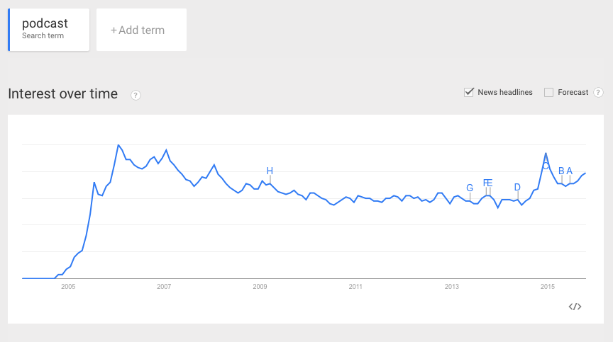

The So-Called Serial Effect
 ---------------------------
 
 Since *Serial* was released, the narrative on podcasting has centered itself on a few cliché phrases: podcasting’s “back,” in a “renaissance,” or a new “golden age.” There is no doubt, of course, that the show marked a watershed moment in podcasting history. It took *This American Life* four years to reach a million downloads per episode; it took *Serial* <a href="http://longform.org/posts/longform-podcast-159-ira-glass">four weeks</a>.<a href=../citations/index.html>12</a> As of October 2015, the show has been <a href="http://www.nytimes.com/2015/10/01/business/media/after-serial-what-podcasts-to-listen-to.html">downloaded over 90 million times</a>.<a href=../citations/index.html>13</a> 

 However, few articles have been able to rigorously justify the “renaissance” moniker beyond *Serial*’s success. First of all, podcasting metrics are notoriously murky, and thus it’s difficult to pinpoint what podcasting <a href="https://medium.com/@pete/downloads-listens-listeners-and-about-those-podcast-numbers-73a5ee3e2fca">download numbers really mean in terms of listener numbers</a> (a single listener can download the same episode multiple times or across devices, inflating download data; plus, a download does not mean the downloader actually listened to the show).<a href=../citations/index.html>14</a> 

 Secondly, many journalists covering this space overlook a vital factor in *Serial*’s success: just a few weeks before the show’s launch, Apple updated its mobile operating system, iOS, to include a native, undeletable podcast app. 

 In all likelihood, this is why podcasting’s first boom never fulfilled its initial promise of mainstream penetration: The technology (which required one to go to the iTunes store, download an episode, and then sync it to your device before you could listen on the go) was just too prohibitive. Apple’s native podcast app, however, significantly lowered the barrier to entry for a great many consumers (as evidenced by the finding that Apple-device podcast downloads outpace Android downloads at a rate of <a href="http://www.libsyn.com/wp-content/uploads/2015/06/PRLibsynNetGrowth021915Final.pdf">5.4 to 1</a>).<a href=../citations/index.html>15</a> Apple’s latest system update, iOS 9, released in September 2015, further reduces the steps to access a podcast in the app. (In addition, it favors streaming; it takes one click to stream, two to download.) *This American Life*’s Seth Lind predicts that the technology will continue to improve, eventually arriving at the point where podcasts, like music, become something listeners can easily and instantly access, rather than have to acquire.<a href=../citations/index.html>16</a> 

 

 

 Figure 1: Percentage of Americans who have listened to a podcast from 2006 to 2015, via “The Podcast Consumer 2015” report, Edison Research. 

 When *Serial* launched, it was the perfect storm: fantastically reported, edge-of-your-seat content released just as for thousands of iPhone users podcasts were suddenly easier to find, subscribe to, and consume. Rob Walch, vice president of Libsyn, argued: “The iPhone has done more for podcasting than anything else.”<a href=../citations/index.html>17</a> 

 Thirdly, despite the fervent media attention, *Serial* did not prompt a significant spike in overall listener growth for podcasts more generally. As Edison Research’ The Podcast Consumer 2015” report shows, although people are now listening to more podcasts, overall audience growth has remained slow and steady for the past decade. Today, a third of the American population has listened to a podcast at least once.<a href=../citations/index.html>18</a> However, these numbers are still nothing in comparison to terrestrial radio’s: <a href="http://www.nielsen.com/us/en/insights/reports/2015/state-of-the-media-audio-today-how-america-listens.html">Over 91 percent of Americans listen to the radio each week</a>, and advertisers spend billions of dollars on radio each year (<a href="http://www.statista.com/topics/1330/radio/">radio is a 16-billion-dollar industry</a>).<a href=../citations/index.html>19</a> Podcasting is still far from meeting radio’s dominance in terms of audience penetration or financial investment. 

 

 

 Figure 2: Frequency of “podcast” as a search term, from 2005 to 2015, via Google Trends. 

 So what has changed since *Serial*? First, improved technology has made podcasts easier to consume. Second, <a href="http://www.edisonresearch.com/the-podcast-consumer-2015/">consumers are becoming more aware of podcasting as a concept</a>. Third, <a href="http://www.edisonresearch.com/the-podcast-consumer-2015/">those who already listen to podcasts are listening to more of them</a>, about six per week.<a href=../citations/index.html>20</a> Fourth, the media has begun to follow podcasting with more acute interest. And fifth, more and more individuals and media outlets are starting to enter the space. <a href="http://www.libsyn.com/wp-content/uploads/2015/06/PRLibsynNetGrowth021915Final.pdf">Libsyn reports</a> that more people signed up for new accounts in 2015 than ever before in the company’s 11-year history.<a href=../citations/index.html>21</a> Since launching in February 2015, <a href="http://panoplymedia.tumblr.com/post/126958922613/eleven-shows-from-sports-illustrated-join-panoply">Panoply has already acquired 20 partners</a> interested in launching podcasts of their own.<a href=../citations/index.html>22</a> Debuting on October 12, WNYC Studios, a new podcasting division of WNYC, has similarly announced its partnerships with various authors, celebrities, and media outlets such as The New Yorker and VICE News.<a href=../citations/index.html>23</a> 

 However, despite all the interest, few creators/outlets seem to know if podcasts can be economically viable. While many articles have focused on the potential of podcasting to grow audiences and earn revenue, there has been no comprehensive overview of how podcasts/networks are earning revenue today. The purpose of this guide is to do just that—to illustrate the state of the podcasting landscape in 2015, and to address the following central questions: Do podcasts generate revenue? How? What are the existing business models? And are they sustainable over the long term? 

