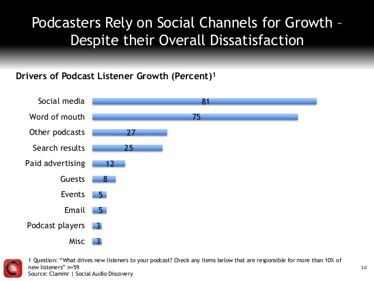

Podcasting’s Barriers to Growth
 -------------------------------
 
 Despite the work that *Serial* has done to make podcasting better known among the public, the concept of podcasting remains foreign to many listeners. Indeed, it could be argued that podcasting remains in an “early adopter phase.” A <a href="http://awesome.midroll.com">Midroll white paper shows that 67 percent of podcast listeners are 18–34</a> (to compare, only 30.2 percent of radio listeners fall in this demographic).<a href=../citations/index.html>45</a> The podcasting audience skews toward the under-40s, a generation for whom the concept of on-demand content makes sense. 

 Clea Conner Chang, the director of marketing for *Intelligence Squared*, described the issue as a branding problem: 

 People say, “What’s a podcast? How do I get a podcast?” It has an inherent branding problem. [...] It’s just radio on demand. You can hear your favorite show any time, and they just don’t realize how it works yet, how convenient it is. It wasn’t until a couple of years ago that streaming video became something with mass appeal, and this is streaming audio. It still hasn’t made that association. [...] Podcasting is on this precipice of being something understood by the masses—it’s not there yet.<a href=../citations/index.html>46</a> 

 Closely related to the conceptual problem of podcasting (what is a podcast?) is the technical problem (how do I get a podcast?). Mark DiCristina, the marketing director for MailChimp (a company that advertises on a variety of popular podcasts, including *Serial*), explained the problem: “People still have to learn how to find podcasts. The whole concept of podcasting is still hard for some people to get their heads around. The technology will get better and there will be easier ways to consume and find podcasts, but right now there’s still a barrier.”<a href=../citations/index.html>47</a> 

 One attempt to overcome this problem and promote podcasting’s cross-generational appeal is Ira Glass’s “How to Listen to a Podcast”video, in which he and his elderly neighbor explain how accessible podcasts really are.<a href=../citations/index.html>48</a> 

 

 

 Figure 5: iOS users account for over 80 percent of podcast listening, Android users for just 16 percent. Clammr “Future of Podcasting 2015” report. 

 Moreover, while podcast listening remains strong on iOS, and Apple’s native podcast app continues to improve, Android users—whose numbers are far greater than iPhone owners (one billion versus 470 million)—remain an untapped audience for whom podcast listening remains difficult.<a href=../citations/index.html>49</a> Apple device podcast downloads outpace Android downloads at a rate of <a href="http://www.libsyn.com/wp-content/uploads/2015/06/PRLibsynNetGrowth021915Final.pdf">5.4 to 1</a>.<a href=../citations/index.html>50</a> Lind put it this way: “This is a moment in podcasting [Google and Samsung are] not capitalizing on.”<a href=../citations/index.html>51</a> 

 Although apps such as Stitcher have emerged to fill the gap for Android users, they don’t compare to the ease of a native app. As Libsyn vice president Rob Walch pointed out, podcasting has been “an Apple-centric media because Apple has been behind it to promote it. Android will never come close to iOS until Google installs a native player in Android.” Indeed, to reach listeners on Android devices, Walch recommends that shows develop their own apps so that users can more easily search for and access their content.<a href=../citations/index.html>52</a> 

 

 

 Figure 6: Social media and word of mouth drive listeners to podcasts. Clammr “Future of Podcasting 2015” report. 

 With or without an app, searching for podcasts remains somewhat difficult on iOS and Android alike. The same is true for discovering new podcasts. According to <a href="http://www.slideshare.net/clammrapp/20150617-future-of-podcasting-2015-clammr-v-f">Clammr’s 2015 survey of podcasters</a>, cross-promotion on other podcasts, social media, and word of mouth remain the main ways listeners learn of new shows.<a href=../citations/index.html>53</a> Walch, who has over a decade of experience in the podcasting space, maintains that word of mouth will remain the most popular way podcasts are discovered and shared.<a href=../citations/index.html>54</a> Others, such as Acast’s Caitlin Thompson and Panoply’s Andy Bowers, point to Netflix, which has successfully used algorithms to aid viewer discovery, as a potential reference point for podcasting’s future.[@thompson] <a href=../citations/index.html>55</a> 

 Companies such as <a href="http://www.clammr.com/">Clammr</a> have emerged to try to make audio—a “fundamentally not social” technology in the words of Clammr CEO Parviz Parvizi—“easier to clip and share on social media.”<a href=../citations/index.html>56</a> Hosting platform <a href="http://www.acast.com/">Acast</a> includes a socially rich player as an incentive for podcasters to use its services. <a href="https://www.popuparchive.com">Pop-Up Archive</a> is transcribing podcasts in an effort to make them both easier to discover and share. A recent <a href="http://audiohackathon.com/">audio hackathon</a>, sponsored by *This American Life*, similarly focused on ways that audio technology could enable more social listening experiences.<a href=../citations/index.html>57</a> 

 Despite these early efforts, podcasting creators remain uncertain of the extent to which improved sharing and discovery tools are vital to podcasting’s growth; far more important, as *New York Magazine*’s Kevin Roose has pointed out, is the development of dashboard technology that will make podcasts easier to listen to in the car.<a href=../citations/index.html>58</a> 

 Because <a href="http://qz.com/195349/the-remarkable-resilience-of-old-fashioned-radio-in-the-us/">almost half of radio listening happens in cars</a>, integrated dashboard technology—such as Apple’s CarPlay and Google’s Android Auto—could offer the key to unlocking audience growth.<a href=../citations/index.html>59</a> As Gimlet Media’s Matt Lieber said, “Until we have a mainstreamed solution to digital audio in cars, we’re being held back.”<a href=../citations/index.html>60</a> Most major automakers have already begun to integrate the technology into their latest models. <a href="http://gizmodo.com/chevy-is-bringing-apple-carplay-and-android-auto-to-the-1707219276">GM, for example, is aggressively adding Apple CarPlay to Chevrolets and Cadillacs</a>.<a href=../citations/index.html>61</a> A report from IT advisory firm <a href="http://www.forbes.com/sites/samsungbusiness/2015/09/23/how-your-car-is-becoming-the-next-hot-tech-gadget/">Gartner predicts that</a> “by the end of 2020, 70 percent to 80 percent of all new vehicles in the United States will offer connected-car functionality.”<a href=../citations/index.html>62</a> Of course, since consumers buy cars <a href="http://www.forbes.com/sites/jimhenry/2012/01/20/average-car-in-the-u-s-now-over-10-years-old-a-record/">every 11 years or so</a>, it will take about that time for radio consumers to convert into podcast listeners in significant numbers.<a href=../citations/index.html>63</a> 

