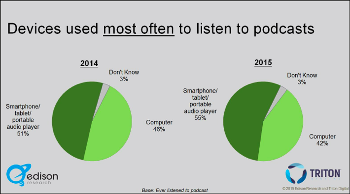

The Growth of Mobile
 --------------------
 
 

 

 Figure 3: Time spent on mobile phones overtakes desktop usage in 2014. By KPCB, accessed via SmartInsights.com 

 <a href="http://www.smartinsights.com/internet-marketing-statistics/insights-from-kpcb-us-and-global-internet-trends-2015-report/">According to a report on mobile technology trends from KPCB</a>, Americans now use their smartphones more than any other device to access the Internet—and it’s a trend that appears to be on the rise.<a href=../citations/index.html>25</a> Similarly, mobile listening is by far the predominant method of podcast consumption today (63 percent of Libsyn-hosted podcasts were requested from mobile devices in 2014, up from 43 percent in 2012, according to <a href="http://www.libsyn.com/wp-content/uploads/2015/06/PRLibsynNetGrowth021915Final.pdf">Libsyn’s internal data</a>), and it continues to grow month by month.<a href=../citations/index.html>26</a> Podcasting should be considered a mobile-first medium. 

 As a mobile medium, podcasts have an advantage over text and video: They can be consumed in the moments when visual media consumption is inconvenient or impossible, like driving, commuting, exercising, doing housework, etc. Angela Stengel, digital product manager at ABC Radio, told me about an in-depth study in which ABC asked its listeners to explain the role that podcasts play in their lives. The study *Reveal*ed that, unlike radio, podcasts serve two kinds of functions: either to keep listeners company in the home or office (in these cases, listeners prefer host-led, chat-based podcasts) or to “transport them to another world” (here, listeners prefer highly produced, story-based podcasts like *Radiolab* or *This American Life*). In either case, however, consumers are generally listening alone, from beginning to end, and engaging intimately with the material.<a href=../citations/index.html>27</a> 

 

 

 Figure 4: Podcast listening according to device. “The Infinite Dial 2015,” Edison Research. 

 This is the kind of insight that podcast creators have long suspected instinctively, but have not had the research to support their claims. As Jenna Weiss-Berman, director of audio at BuzzFeed, told me: “I don’t think it’s the kind of medium that lends itself to virality. It’s not a one-minute video, and it’s not an article you can quickly scroll through and look at the pictures and say you read it. You have to sit and engage.”<a href=../citations/index.html>28</a> 

 As such, podcasting offers an alternative vehicle for journalism: one which is easily accessible on mobile phones (where more and more consumers spend their time), privileged at certain hours of the day, and has the unique characteristic of eliciting consumers’ close attention. 

